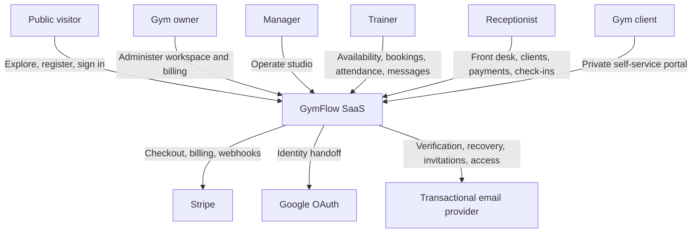
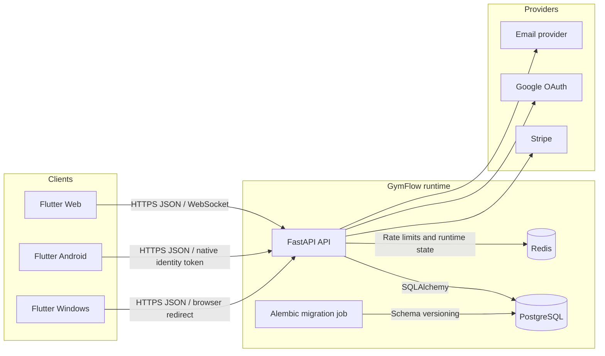
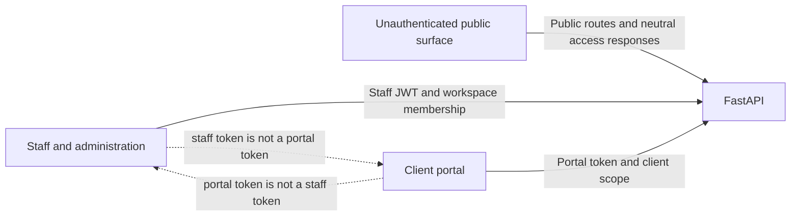
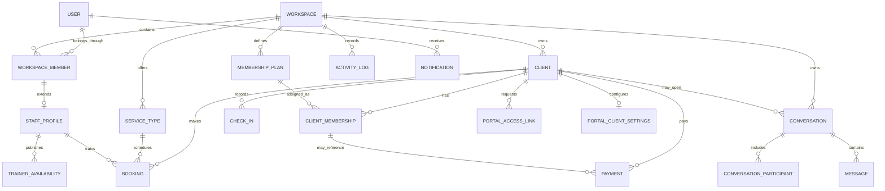
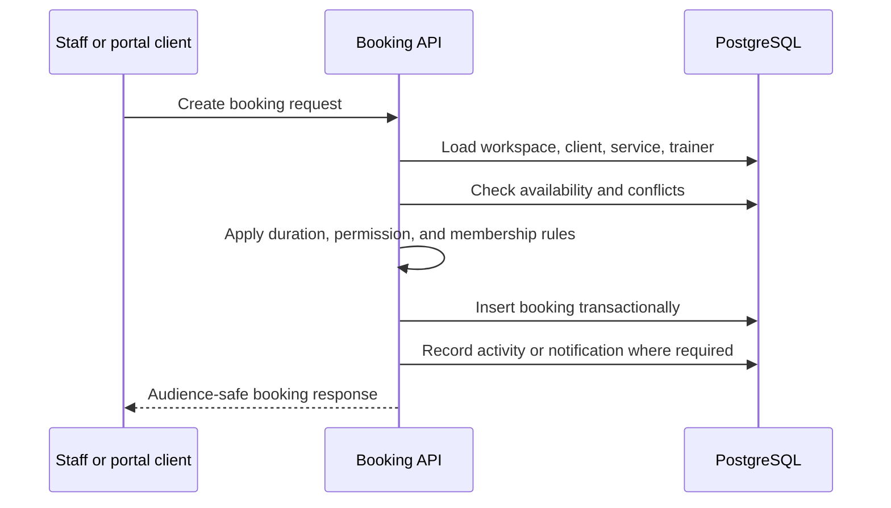
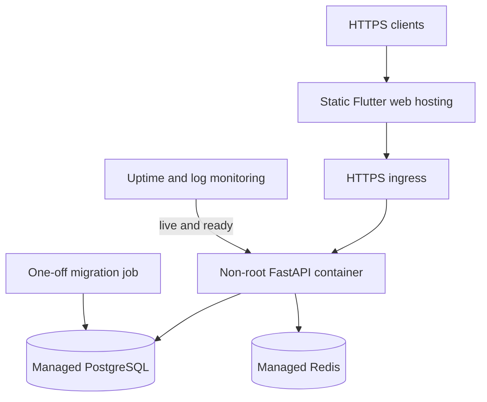

# GymFlow Architecture

GymFlow is a multi-tenant gym operations SaaS with three user-facing surfaces, a
versioned backend API, relational persistence, real-time collaboration, provider
integrations, and explicit environment safety boundaries.

This document describes the architecture represented by the current showcase
release.

## Architectural goals

GymFlow was designed to:

1. isolate every studio's business data by workspace;
2. give owners, managers, trainers, receptionists, and clients distinct
   capabilities;
3. keep the client portal outside the staff trust domain;
4. model gym operations as connected relational workflows;
5. support web, Android, and Windows from one Flutter codebase;
6. integrate external providers without making them hidden runtime assumptions;
7. separate development, test, demo, and production behavior;
8. connect frontend failures to backend diagnostics;
9. keep schema evolution and demo rebuilding safe and repeatable.

## System context



## Runtime architecture



| Component | Responsibility |
|---|---|
| Flutter client | Public site, staff application, client portal, responsive UI, localization |
| FastAPI API | Authentication, authorization, validation, business rules, provider coordination |
| PostgreSQL | Durable relational state and transactional integrity |
| Redis | Shared rate-limit state and runtime coordination where configured |
| Alembic migration job | Intentional schema upgrades separate from application startup |
| External providers | Payment, identity, and transactional-email boundaries |

## Trust domains

GymFlow separates public, staff, and client-portal access.



| Surface | Credential | Data boundary |
|---|---|---|
| Public | None | Marketing, public authentication, neutral identity-sensitive responses |
| Staff application | Staff JWT | Workspace-scoped data permitted by role and membership |
| Client portal | Portal token | Portal-safe data for one workspace and client |

Frontend route guards improve navigation and user experience. Backend route
dependencies and scoped queries remain the security authority.

## Multi-tenant workspace model

The workspace is the primary tenant boundary. Users join workspaces through
membership records, and role and status belong to that membership rather than a
global account flag.

Workspace-owned areas include:

- staff profiles and invitations;
- clients and memberships;
- plans and services;
- trainer availability;
- bookings and check-ins;
- payments and reports;
- notifications and activity logs;
- conversations and messages;
- portal settings and access records.

The central invariant is:

> A user authorized in Workspace A cannot read or mutate Workspace B records
> unless that user independently holds valid membership in Workspace B.

## Domain model

The diagram shows the primary business relationships rather than every
implementation column.



## Frontend architecture

The Flutter application is organized by feature rather than as one global UI
layer.

```text
feature/
├── data/
│   ├── models
│   ├── repositories
│   └── display and localization helpers
├── state/
│   └── controllers or coordinators
└── presentation/
    ├── pages
    └── widgets
```

| Concern | Approach |
|---|---|
| Routing | `go_router` with public, auth, staff, billing-gated, and portal routes |
| State | Controllers expose loading, error, empty, and ready states |
| API access | Repositories isolate HTTP, parsing, and error envelopes |
| Permissions | Role-derived route and action permissions improve UX |
| Sessions | Staff and portal sessions are stored and resolved separately |
| Localization | ARB-generated `AppLocalizations` and shared display helpers |
| Responsiveness | Explicit desktop, tablet, and mobile layout tiers |
| Real-time behavior | WebSocket and heartbeat coordination where supported |
| Provider returns | Safe Stripe and OAuth callback handling |

The router rejects unsafe redirect targets, prevents public or staff flows from
crossing into the portal trust domain, applies workspace permission redirects,
and restores staff and portal sessions independently.

## Backend architecture

The FastAPI application is grouped under `/api/v1` by business capability.

Major route groups include authentication, workspaces, invitations, clients,
memberships, staff, presence, availability, services, bookings, check-ins,
payments, billing, reports, notifications, activity history, messaging, and the
client portal.

| Layer | Responsibility |
|---|---|
| API routes | HTTP contract, dependency injection, authorization entry point |
| Pydantic schemas | Input validation and audience-safe response shapes |
| Services | Business rules, lifecycle transitions, provider coordination, transactions |
| Repositories and queries | Database access with workspace and resource scoping |
| SQLAlchemy models | Relationships, constraints, indexes, and persistence |
| Core and middleware | Settings, authentication, rate limits, logs, request IDs, headers |
| Alembic | Published schema migration history |

## Authentication and authorization

GymFlow supports email and password authentication, email verification,
password recovery, Google OAuth, staff invitations, and one-time client portal
access.

Role alone is not sufficient for authorization. Decisions combine:

- credential type;
- authenticated subject;
- active workspace membership;
- role and membership status;
- requested operation;
- resource workspace;
- client ownership for portal data;
- message audience and participant rules.

A receptionist can operate front-desk workflows without managing SaaS billing.
A trainer can see assigned schedules and permitted clients without owning the
workspace. A portal client can see only portal-safe data for the associated
client record.

## Booking and attendance design

A booking connects workspace, client, service, optional trainer, service
duration, availability, lifecycle state, recurring-series context,
attendance outcome, and possible payment context.



Attendance is stored separately so a booking lifecycle and a physical visit do
not have to be represented as the same event.

## Payments and billing

GymFlow has two financial domains:

1. **Client payments** — obligations and payments between a client and studio.
2. **SaaS billing** — the studio's subscription relationship with GymFlow.

The domains share provider infrastructure but remain separate business models.
The demo includes paid, pending, failed, refunded, and cancelled records. GymFlow
does not store card numbers.

Webhook handling verifies signatures, stores provider event identifiers, detects
duplicates, and applies idempotent state transitions.

## Messaging architecture

Messaging is a workflow system rather than a simple chat table. It supports:

- authorized participants;
- staff assignment and queue claiming;
- priority and status;
- client-visible replies;
- staff-only internal notes;
- cursor pagination;
- retry-safe send identifiers;
- optimistic workflow versions;
- lifecycle cleanup and abuse limits.

Audience-specific response schemas prevent client requests from receiving
internal notes or operational metadata.

## Staff presence

Presence combines connection heartbeat and recent user activity. Multiple
devices are aggregated so a single tab disconnect does not incorrectly force a
person offline. Online, away, offline, and last-seen data are exposed according
to role and visibility policy.

## Observability and security middleware

Every request receives an `X-Request-ID` that can be correlated across response
headers, structured logs, validation errors, exception logs, and frontend support
context.

The API includes trusted-host validation, controlled CORS, sensitive request-size
limits, authentication and portal rate limits, security headers, generic
unhandled-error responses, and production-only disabling of debug and API
documentation routes.

| Endpoint | Meaning |
|---|---|
| `/api/v1/health/live` | The process is running |
| `/api/v1/health/ready` | Required dependencies are usable |

Readiness returns `503` when PostgreSQL or required production Redis state is
unavailable.

## Environment architecture

| Environment | Behavior |
|---|---|
| Development | Local origins, debug support, provider test configuration |
| Test | Deterministic settings and isolated services for automated validation |
| Demo | Dedicated guarded database and fictional identities |
| Production | Strong secrets, Redis, HTTPS origins, trusted hosts, disabled debug routes, strict providers |

The local Docker selector accepts only the reviewed `gymflow` and
`gymflow_demo` database names.

## Deployment model



Production migrations are separate from the web start command, avoiding hidden
schema changes during ordinary application restarts.

## Deterministic demo architecture

The demo rebuild verifies the environment, database target, host, Stripe mode,
migration state, table allowlist, and explicit confirmation before changing
data.

It then acquires a PostgreSQL advisory transaction lock, deletes only allowlisted
records in dependency order, creates the Northline scenario, validates the full
business story, and commits only if every check succeeds. It never drops schemas
or tables and never modifies `alembic_version`.

## Architectural decisions

| Decision | Reason | Trade-off |
|---|---|---|
| Flutter across client targets | Shared product logic and consistent design | Platform integrations still need adapters |
| FastAPI and Pydantic | Typed contracts and clear validation | Route and service boundaries require discipline |
| PostgreSQL relational model | Strong relationships and transactional rules | Schema changes require migrations |
| Workspace membership boundary | Multi-workspace users and scoped roles | Every business query must preserve scope |
| Separate portal token | Least privilege and safer client UX | Two session models must be maintained |
| Separate migration job | Predictable deployment and explicit schema changes | Deployment has an additional step |
| Redis-backed production limits | Shared abuse-control state across instances | Production requires another managed service |
| Deterministic demo rebuild | Repeatable review and release evidence | Seed contracts evolve with the product |
| Internal-note separation | Protects client-facing audiences | Messaging schemas and tests are more complex |
| Connection and activity presence | More accurate online and away states | Multi-device lifecycle logic is required |

## Production boundary

The architecture is production-oriented, but a live commercial launch still
requires deployment-specific verification of hosting, managed PostgreSQL and
Redis, Stripe and OAuth callbacks, verified email delivery, monitoring,
alerting, backups, restore drills, vulnerability scanning, and operational
ownership.

See the [Security Overview](docs/SECURITY_OVERVIEW.md),
[Threat Model](docs/THREAT_MODEL.md), and
[Operations](docs/OPERATIONS.md) for the related controls and responsibilities.
