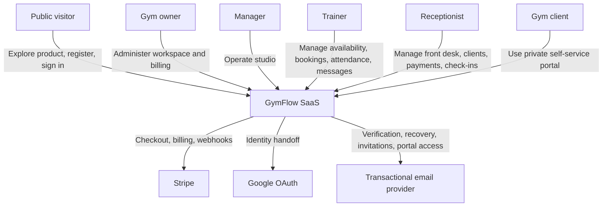
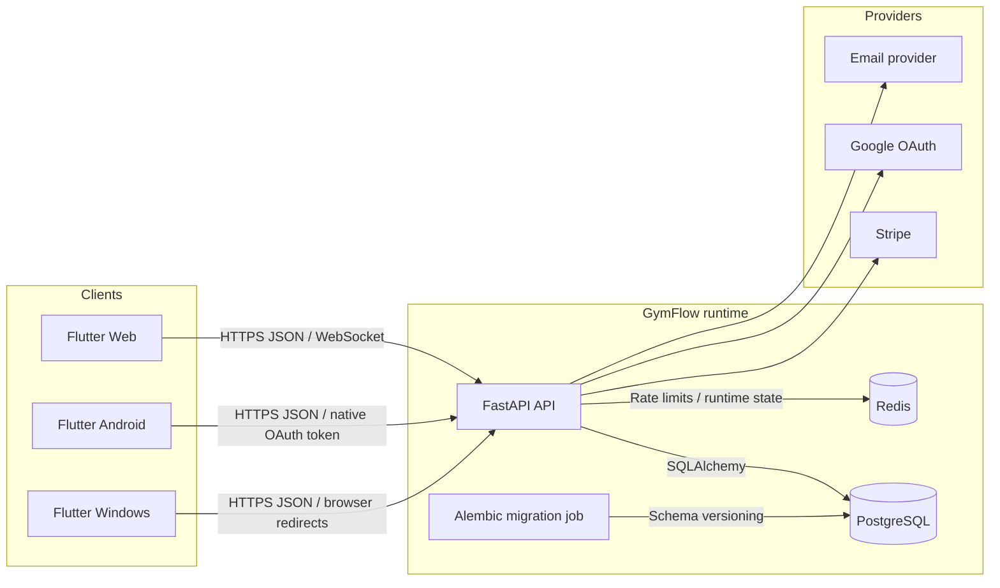
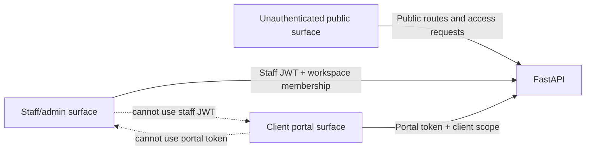
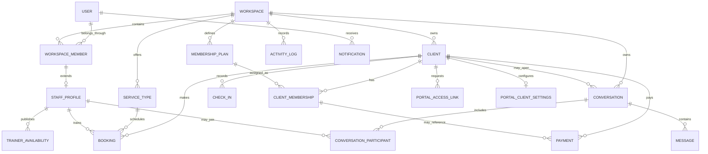
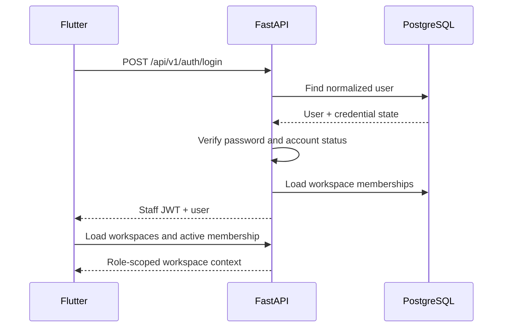
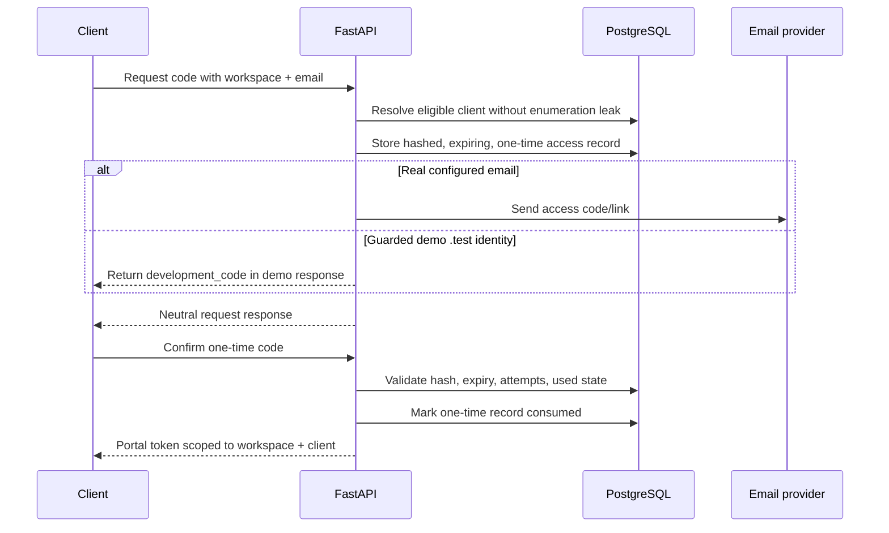
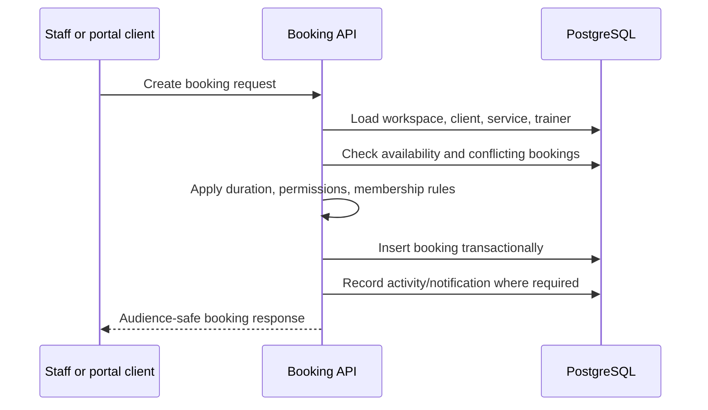
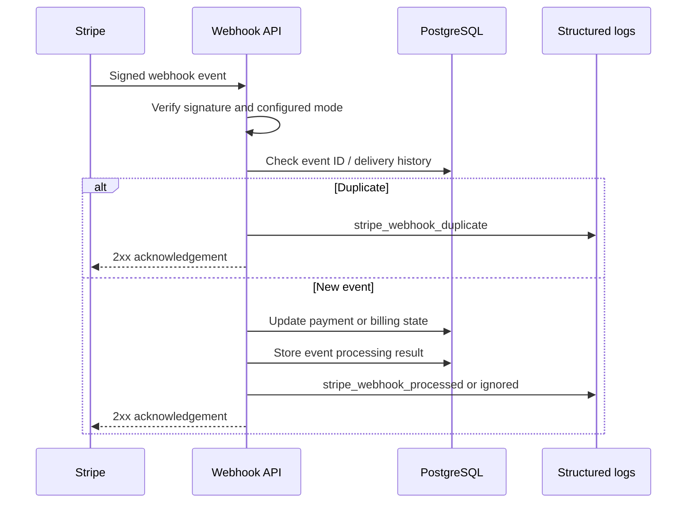
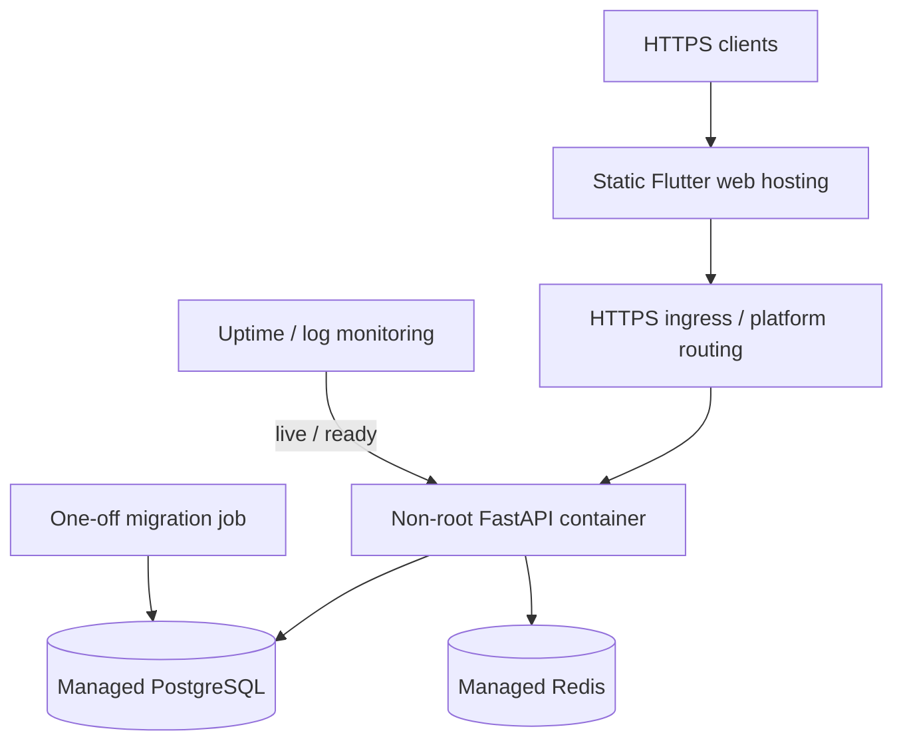

# GymFlow Architecture

GymFlow is a multi-tenant gym operations SaaS with three user-facing surfaces, a versioned backend API, relational persistence, real-time collaboration, provider integrations, and explicit environment safety boundaries.

This document describes the architecture of the current release candidate rather than listing UI pages in isolation.

## Architectural goals

GymFlow was designed around these goals:

1. Keep every studio's business data isolated by workspace.
2. Give owners, managers, trainers, receptionists, and clients different capabilities.
3. Keep the client portal outside the staff trust domain.
4. Model gym operations as connected relational workflows.
5. Support web, Android, and Windows from one Flutter codebase.
6. Integrate external providers without making them hidden runtime assumptions.
7. Make local development, automated testing, portfolio demo, and production configuration explicit.
8. Provide diagnostics that connect frontend failures to backend logs.
9. Keep schema evolution and demo rebuilding safe and repeatable.

## 1. System context



## 2. Container architecture



### Container responsibilities

| Container | Responsibility |
|---|---|
| Flutter client | Public site, staff dashboard, client portal, local state, responsive UI, localization |
| FastAPI API | Authentication, authorization, validation, business rules, provider coordination |
| PostgreSQL | Durable relational state and transactional integrity |
| Redis | Production rate-limit state and runtime coordination where configured |
| Alembic migration job | Intentional schema upgrades separate from web process startup |
| Stripe | Test/live payment and billing provider according to environment configuration |
| Google OAuth | External identity provider |
| Email provider | Verification, recovery, staff invitation, and portal access delivery |

## 3. User surfaces and trust boundaries

GymFlow intentionally separates three security surfaces.



| Surface | Credential | Allowed data |
|---|---|---|
| Public | None | Marketing, public auth, neutral access responses |
| Staff dashboard | Staff JWT | Workspace-scoped data allowed by role |
| Client portal | Portal token | One client's portal-safe data |

The frontend has route guards for user experience and safe navigation. The backend remains authoritative for every protected operation.

## 4. Multi-tenant workspace model

The workspace is the primary tenant boundary.

A user may belong to one or more workspaces through a workspace-member record. Role and status are attached to that membership rather than treated as a universal global permission.

Workspace-owned data includes:

- staff profiles;
- clients;
- membership plans;
- client memberships;
- service types;
- trainer availability;
- bookings;
- check-ins;
- payments;
- reports;
- notifications;
- activity logs;
- conversations and messages;
- portal settings and access records.

The expected invariant is:

> A user authorized in Workspace A cannot read or mutate Workspace B records unless they independently hold a valid membership in Workspace B.

## 5. Domain model

The diagram below is intentionally simplified. It shows business relationships rather than every implementation column.



## 6. Frontend architecture

The Flutter application is organized by feature rather than as one global UI layer.

Typical feature slice:

```text
feature/
├── data/
│   ├── models
│   ├── repository
│   └── display/localization helpers
├── state/
│   └── controller or coordinator
└── presentation/
    ├── pages
    └── widgets
```

### Frontend responsibilities

| Concern | Approach |
|---|---|
| Routing | `go_router` with public, auth, staff, billing-gated, and portal routes |
| State | Controllers expose loading, error, empty, and ready states |
| API access | Repositories isolate HTTP and response parsing |
| Permissions | Role-derived route/action permissions improve UX |
| Session handling | Staff and portal sessions are stored and resolved separately |
| Localization | ARB-generated `AppLocalizations` plus display helpers |
| Responsiveness | Explicit desktop, tablet, and mobile layout tiers |
| Real-time behavior | WebSocket/realtime service plus heartbeat coordination where supported |
| Provider returns | Safe Stripe and OAuth callback/return handling |

### Router safety decisions

The router:

- rejects unsafe external-style redirect targets;
- prevents auth redirects into portal paths;
- keeps cached portal sessions from entering staff-only areas;
- applies workspace permission redirects;
- gates unusable billing states;
- restores staff and portal sessions independently.

## 7. Backend architecture

The backend is a FastAPI application grouped under `/api/v1`.

Major route groups include:

- health and readiness;
- authentication and Google OAuth;
- email verification and password recovery;
- workspaces and members;
- invitations;
- clients and memberships;
- staff, presence, and availability;
- services and bookings;
- check-ins;
- payments and SaaS billing;
- reports and exports;
- notifications and activity logs;
- messaging;
- portal access, dashboard, settings, payments, receipts, and protected portal routes.

### Backend layers

| Layer | Responsibility |
|---|---|
| API routes | HTTP contract, dependency injection, authorization entry point |
| Pydantic schemas | Input validation and audience-safe response shapes |
| Services | Business rules, provider coordination, transaction-level behavior |
| Repositories/queries | Database access and workspace-scoped retrieval |
| SQLAlchemy models | Persistence model, relationships, constraints, indexes |
| Core/middleware | Settings, auth, rate limits, logging, request IDs, headers |
| Alembic | Versioned schema migration history |

## 8. Authentication flows

GymFlow supports multiple identity and access paths because one mechanism is not suitable for every user.

| Flow | Purpose |
|---|---|
| Email/password | Standard staff authentication |
| Email verification | Prove account email control |
| Password recovery | Time-limited account recovery |
| Google OAuth | External identity provider handoff |
| Staff invitation | Add a user to a workspace with a role |
| Client portal one-time access | Give a client portal access without making them staff |

### Staff login sequence



### Portal access sequence



## 9. Authorization model

Authorization combines:

- authenticated identity;
- credential type;
- workspace membership;
- role;
- membership status;
- resource ownership;
- operation type.

Examples:

- A receptionist may operate front-desk workflows without managing SaaS billing.
- A trainer may see assigned schedules and permitted clients without owning the workspace.
- A portal client may see only portal-safe data for their own client record.
- Internal message notes are never serialized into client-facing responses.

## 10. Booking and attendance design

A booking is not just a date field. It connects:

- workspace;
- client;
- service;
- optional trainer;
- service duration;
- trainer availability;
- lifecycle state;
- recurring-series context;
- attendance/no-show outcome;
- possible payment context.

### Booking sequence



Attendance is stored separately so a booking lifecycle and a physical visit do not have to be treated as the same event.

## 11. Payment and billing design

GymFlow has two financial domains:

1. **Client payments** — money the client owes or pays to the studio.
2. **SaaS billing** — the studio's subscription relationship with GymFlow.

They share provider infrastructure but are not represented as the same business entity.

### Payment states

The demo scenario includes paid, pending, failed, refunded, and cancelled records. No card number is stored by GymFlow.

### Stripe webhook sequence



## 12. Messaging architecture

Messaging was designed as a workflow system rather than a simple chat table.

Capabilities include:

- conversation participants;
- role-restricted access;
- staff assignment and queue claiming;
- priority and status;
- client-visible messages;
- staff-only internal notes;
- cursor pagination;
- idempotent/retry-safe send behavior;
- optimistic workflow versions;
- lifecycle cleanup and abuse limits.

The API uses audience-specific response schemas so client requests cannot accidentally receive internal notes or operational metadata.

## 13. Staff presence architecture

Presence uses two related but different signals:

- **connection heartbeat** — whether an authenticated client is connected;
- **user activity** — whether the person has interacted recently.

Multiple devices are aggregated. A person can remain online while one tab disconnects, and become away based on activity policy without losing an authenticated connection.

Visibility is role-aware. Administrative users can receive more operational status detail than ordinary staff when policy permits.

## 14. Observability architecture

Every request receives an `X-Request-ID`.

The same ID can appear in:

- response headers;
- structured access logs;
- validation and error envelopes;
- unhandled exception logs;
- frontend support/debug context.

Structured logs include method, path, status, duration, client context, and request ID. Provider-specific events add operational metadata without exposing secrets.

Health endpoints are separated:

| Endpoint | Meaning |
|---|---|
| `/api/v1/health/live` | Process is running |
| `/api/v1/health/ready` | Required dependencies are usable |

Readiness checks database and required Redis state and returns `503` when the service should not receive traffic.

## 15. Security middleware

The application keeps these protections at the framework boundary:

- trusted-host validation;
- exact/controlled CORS behavior;
- request-size limits for sensitive public POST routes;
- rate limits for auth and portal access;
- security headers;
- request-ID propagation;
- generic unhandled-error responses;
- production-only disabling of debug routes and API docs.

See [Security Overview](docs/SECURITY_OVERVIEW.md) and [Threat Model](docs/THREAT_MODEL.md).

## 16. Environment architecture

| Environment | Important behavior |
|---|---|
| Development | Local origins, debug support, provider test configuration |
| Test | Deterministic settings for CI and isolated databases |
| Demo | Dedicated guarded database and fictional identities; not an alias for development |
| Production | Strong secret, Redis, HTTPS origins, trusted hosts, disabled debug/docs, strict provider checks |

The local Docker selector permits only the approved `gymflow` and `gymflow_demo` database names. It does not dynamically accept arbitrary targets.

## 17. Deployment architecture



The production migration command is separate from the web start command. This avoids hidden schema mutations every time an application instance restarts.

## 18. Demo data architecture

The professional demo rebuild is transactional and deterministic.

Before deleting data, it verifies:

- `ENVIRONMENT=demo`;
- a local approved `_demo` database;
- Stripe test mode and no live Stripe state;
- current Alembic revision expectations;
- a reviewed table allowlist;
- an exact confirmation value.

It then:

1. acquires a PostgreSQL advisory transaction lock;
2. deletes allowlisted business/authentication data in dependency order;
3. creates the complete Northline scenario;
4. validates dashboard, reporting, payment, portal, presence, and relationship targets;
5. commits only if every validation passes.

It never drops tables or schemas and never modifies `alembic_version`.

## 19. Important architectural decisions

| Decision | Reason | Trade-off |
|---|---|---|
| Flutter for all client targets | Shared product logic and consistent design across web/mobile/desktop | Platform-specific integrations still require adapters |
| FastAPI + Pydantic | Typed API contracts, rapid iteration, clear validation | Requires discipline to keep route/service boundaries clean |
| PostgreSQL relational model | Business entities have strong relationships and transactional rules | Schema changes require migrations |
| Workspace membership as tenant/role boundary | Supports multi-workspace users and scoped roles | Every business query must preserve workspace scope |
| Separate client portal token | Least privilege and safer client UX | Two session models must be maintained |
| Separate migration job | Predictable deployment and explicit schema changes | Deployment orchestration has an extra step |
| Redis-required production rate limits | Shared state across API instances | Production requires another managed dependency |
| Deterministic demo rebuild | Repeatable screenshots, video, and QA | Seed contracts must evolve with the product |
| Internal-note/client-message separation | Prevents audience data leaks | Messaging schemas and tests are more complex |
| Connection/activity presence split | More accurate online/away behavior | Requires lifecycle and multi-device logic |

## 20. Known architecture boundaries

The system is production-oriented, but a real production launch still requires environment-specific verification of:

- hosted frontend and backend;
- managed PostgreSQL and Redis;
- verified Stripe live/test separation and webhooks;
- verified email sender domain;
- production Google OAuth redirects;
- monitoring and alert thresholds;
- backup schedule and restore drill;
- dependency and container vulnerability scanning.

Those are release and operations responsibilities, not reasons to weaken the architecture description.
