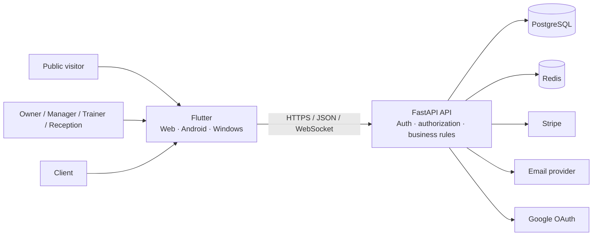

# GymFlow

**A multi-tenant gym operations SaaS built with Flutter, FastAPI, PostgreSQL, Redis, Stripe, and Docker.**

GymFlow connects public product discovery, staff operations, and private client self-service in one workspace-scoped system. It covers clients, memberships, services, bookings, attendance, payments, reporting, messaging, notifications, staff presence, localization, and SaaS billing.

> This repository is the public engineering case study for a private-source application. It contains reviewed documentation and visual evidence rather than the frontend or backend source code.

## Release status

| Record | Value |
|---|---|
| Current `main` line | `v1.0.2-showcase` tag-bound release record |
| Latest immutable showcase tag | `v1.0.1-showcase` |
| Frontend revision | `b73a623c3985e4bc458d04b4b484887ada593fa5` |
| Backend revision | `2234af20d1d9dd143bcac22edc699d3ee7fe515f` |
| Evidence model | 53 unique screenshots across five galleries |
| Validation | Local release validation; no green hosted-CI claim |

`v1.0.2-showcase` is an evidence-integrity correction line. The record remains accurate on `main` before tagging and becomes immutable when the target tag points to the reviewed commit. It keeps the same canonical application revisions while strengthening release truth, tracked-file validation, local tooling, regression tests, and the machine-readable evidence record.

## Product surfaces

| Surface | Primary users | Responsibility |
|---|---|---|
| Public website | Prospective studios and visitors | Product discovery, pricing, security, contact, and legal information |
| Studio application | Owner, manager, trainer, receptionist | Daily business and operational workflows |
| Client portal | Gym clients | Private self-service outside the staff trust domain |

## Selected evidence

### Owner command center


### Connected client lifecycle


### Professional communication


### Client scheduling


### Mobile member experience


### Arabic and RTL presentation


The complete evidence index is available in the [GymFlow Visual Gallery](screenshots/README.md).

## Engineering highlights

| Area | Evidence |
|---|---|
| Multi-tenancy | Workspace membership boundary and workspace-scoped queries |
| Authorization | Role, credential type, membership status, resource scope, and audience checks |
| Portal isolation | Separate portal token and client-scoped response surfaces |
| Scheduling | Service duration, trainer availability, conflicts, recurrence, cancellation, and no-show states |
| Payments | Manual collection, Stripe test flows, webhook verification, duplicate protection, and receipts |
| Messaging | Assignment queue, priorities, internal notes, cursor pagination, retry-safe sends, and optimistic conflicts |
| Presence | Heartbeats, recent activity, multiple-device aggregation, and role-aware visibility |
| Reliability | Transactions, advisory locks, idempotency, readiness checks, and neutral public responses |
| Internationalization | English, French, Arabic, RTL, and responsive layout tiers |
| Release engineering | Deterministic demo data, exact source provenance, rejected-media hashes, and tag validation |

## Architecture



The main boundaries are:

1. **Workspace isolation** — business records belong to one studio workspace.
2. **Backend authorization** — frontend permissions improve UX; backend checks remain authoritative.
3. **Separate trust domains** — staff JWTs and client portal tokens are intentionally different.
4. **Provider boundaries** — Stripe, email, and OAuth require explicit environment configuration.
5. **Environment boundaries** — development, test, demo, and production use different safety contracts.

Read the full [architecture case study](ARCHITECTURE.md).

## Deterministic professional demo

The fictional **Northline Performance Club** scenario is rebuilt transactionally and validated before commit. It includes connected staff, clients, plans, memberships, services, bookings, check-ins, payments, reports, notifications, presence, messaging, and portal stories.

The destructive rebuild refuses unsafe environments, arbitrary or remote databases, live Stripe configuration, unknown application tables, and missing confirmation. It never drops schemas or modifies `alembic_version`.

See the [Demo Environment](DEMO.md) and [Build Manifest](BUILD_MANIFEST.md).

## Local release validation

The showcase deliberately uses a traditional local release gate while hosted Actions are unavailable. The validation entry points are:

```powershell
.\scripts\validate_release.ps1
.\scripts\validate_release.ps1 -Release
```

```bash
bash scripts/validate_release.sh
bash scripts/validate_release.sh --release
```

The local gate runs validator unit tests, repository and media checks, provenance checks, and optional release-tag verification. It inspects tracked Git content rather than failing on unrelated local cache files.

The machine-readable release record is [release/evidence-manifest.json](release/evidence-manifest.json).

## Evidence boundary

This repository intentionally contains no:

- application source code;
- environment files or production credentials;
- real client, staff, payment, or message data;
- installable application binary;
- provenance-bound walkthrough video for the current release line.

Provider-dependent production operation—including live Stripe, verified email, OAuth deployment configuration, hosting, monitoring, backups, restore drills, and legal ownership—remains environment-specific.

## Documentation map

| Document | Purpose |
|---|---|
| [Product](docs/PRODUCT.md) | Users, product areas, and connected workflows |
| [Architecture](ARCHITECTURE.md) | Runtime, trust boundaries, data model, deployment, and decisions |
| [Engineering](docs/ENGINEERING.md) | Implementation depth, failure handling, and trade-offs |
| [Security policy](SECURITY.md) | Private vulnerability reporting |
| [Security overview](docs/SECURITY_OVERVIEW.md) | Implemented controls and privacy boundaries |
| [Threat model](docs/THREAT_MODEL.md) | Threats, mitigations, and residual verification |
| [Quality](docs/QUALITY.md) | Risk-to-evidence strategy and release gates |
| [Operations](docs/OPERATIONS.md) | Configuration, migrations, observability, backup, and deployment |
| [Demo](DEMO.md) | Deterministic scenario and destructive-operation safeguards |
| [Release integrity](RELEASES.md) | Versioning, validation policy, and correction rules |
| [Roadmap](ROADMAP.md) | Product evolution and production-operation work |
| [Build manifest](BUILD_MANIFEST.md) | Canonical revisions and candidate artifact record |
| [Evidence manifest](release/evidence-manifest.json) | Machine-readable release and gallery contract |

## Project ownership

GymFlow was designed and implemented end to end by **Anes** as a demonstration of full-stack product and software-engineering capability.

## License

The documentation, branding, screenshots, diagrams, and approved artifacts are protected by the repository's [license](LICENSE). Viewing and linking are permitted; reuse or redistribution requires permission unless an artifact states otherwise.
