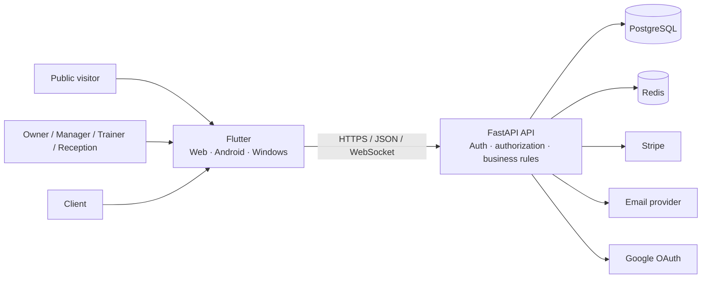

# GymFlow

**A multi-tenant gym operations SaaS built with Flutter, FastAPI, PostgreSQL, Redis, Stripe, and Docker.**

GymFlow connects public product discovery, staff operations, and private client self-service in one workspace-scoped system. It covers clients, memberships, services, bookings, attendance, payments, reporting, messaging, notifications, staff presence, localization, and SaaS billing.

This repository presents GymFlow as a public engineering case study. The application implementation remains private, with selected read-only source access available for serious technical or recruitment review.

## Product at a glance

| Surface | Primary users | What it provides |
|---|---|---|
| Public website | Prospective studios and visitors | Product discovery, pricing, security, contact, and legal information |
| Studio application | Owner, manager, trainer, receptionist | Daily business and operational workflows |
| Client portal | Gym clients | Private self-service outside the staff trust domain |

## Product highlights

### Owner command center

### Connected client lifecycle

### Professional communication

### Client scheduling

### Mobile member experience

### Arabic and RTL presentation

The complete product and engineering gallery is available in the [GymFlow Visual Gallery](screenshots/README.md).

## Engineering highlights

| Area | Implementation |
|---|---|
| Multi-tenancy | Workspace membership boundary and workspace-scoped queries |
| Authorization | Role, credential type, membership status, resource scope, and audience checks |
| Portal isolation | Separate portal token and client-scoped response surfaces |
| Scheduling | Service duration, trainer availability, conflicts, recurrence, cancellation, and no-show states |
| Payments | Manual collection, Stripe test flows, webhook verification, duplicate protection, and receipts |
| Messaging | Assignment queue, priorities, internal notes, cursor pagination, retry-safe sends, and optimistic conflicts |
| Presence | Heartbeats, recent activity, multiple-device aggregation, and role-aware visibility |
| Reliability | Transactions, advisory locks, idempotency, readiness checks, and neutral public responses |
| Internationalization | English, French, Arabic, RTL, and responsive layout tiers |
| Release engineering | Deterministic demo data, exact source provenance, gallery integrity, and tagged showcase records |

## Architecture

The architecture is organized around five important boundaries:

1. **Workspace isolation** — business records belong to one studio workspace.
2. **Backend authorization** — frontend permissions improve UX; backend checks remain authoritative.
3. **Separate trust domains** — staff JWTs and client portal tokens are intentionally different.
4. **Provider boundaries** — Stripe, email, and OAuth are integrated through explicit environment configuration.
5. **Environment boundaries** — development, test, demo, and production use different safety contracts.

Read the full [architecture case study](ARCHITECTURE.md) or the [engineering deep dive](docs/ENGINEERING.md).

## A connected SaaS, not a collection of screens

GymFlow is built around relationships between the product areas. A client can receive a membership, make payments, book a trainer-aware service, check in at the front desk, receive notifications, use a private portal, and participate in support conversations while the same records feed dashboards and reports.

The workspace model keeps studio data scoped by tenant and role. The client portal uses a separate credential and response surface instead of treating clients as reduced-permission staff users. Messaging separates internal staff notes from client-visible replies, while booking and payment workflows preserve lifecycle and provider state across the frontend, API, and database.

The [Product Model](docs/PRODUCT.md) walks through these workflows in detail, and the [Engineering Journey](docs/ENGINEERING_JOURNEY.md) explains how the architecture evolved as the project grew.

## Deterministic professional demo

The fictional **Northline Performance Club** scenario creates a connected operating story with staff, clients, plans, memberships, services, bookings, check-ins, payments, reports, notifications, presence, messaging, and client-portal activity.

The demo can be rebuilt transactionally and validates its relationships before commit. Guardrails keep the rebuild scoped to an approved demo environment and Stripe test behavior.

See the [Demo Environment](DEMO.md) for the scenario and safeguards.

## Showcase release

The latest tagged public snapshot is **`v1.0.3-showcase`**, representing:

- frontend `b73a623c3985e4bc458d04b4b484887ada593fa5`;
- backend `2234af20d1d9dd143bcac22edc699d3ee7fe515f`;
- Alembic head `9e4f6a8c2d1b`;
- 53 reviewed screenshots across desktop, client portal, mobile, localization, and engineering views.

The release system records exact source revisions, gallery integrity, demo boundaries, and validation commands. Those details live in [Release Integrity](RELEASES.md), the [Build Manifest](BUILD_MANIFEST.md), and the machine-readable [`release/evidence-manifest.json`](release/evidence-manifest.json), keeping the landing page focused on the product itself.

## Source access

GymFlow's frontend and backend repositories remain private. Selected read-only access may be considered case-by-case for technical review, recruitment, collaboration, or partnership discussions.

Contact the project owner through the GitHub account [@anes-dev-ml](https://github.com/anes-dev-ml).

Source access is for review; reuse or redistribution requires separate permission.

## Documentation

| Document | Purpose |
|---|---|
| [Product](docs/PRODUCT.md) | Users, product areas, and connected workflows |
| [Architecture](ARCHITECTURE.md) | Runtime, trust boundaries, data model, deployment, and decisions |
| [Engineering](docs/ENGINEERING.md) | Implementation depth, failure handling, and trade-offs |
| [Engineering journey](docs/ENGINEERING_JOURNEY.md) | How the system evolved and what the project taught |
| [Security overview](docs/SECURITY_OVERVIEW.md) | Implemented controls and privacy boundaries |
| [Threat model](docs/THREAT_MODEL.md) | Threats, mitigations, and residual verification |
| [Quality](docs/QUALITY.md) | Test strategy, manual review, and release gates |
| [Operations](docs/OPERATIONS.md) | Configuration, migrations, observability, backup, and deployment |
| [Demo](DEMO.md) | Deterministic scenario and destructive-operation safeguards |
| [Release integrity](RELEASES.md) | Versioning, validation policy, and provenance |
| [Roadmap](ROADMAP.md) | Product evolution and path toward commercial operation |
| [Build manifest](BUILD_MANIFEST.md) | Canonical application revisions and release record |
| [Visual gallery](screenshots/README.md) | Complete screenshot and engineering-view collection |

## Project ownership

GymFlow was designed and implemented end to end by **Anes** as a full-stack product and software-engineering project.

## License

The documentation, branding, screenshots, diagrams, and approved artifacts are protected by the repository's [license](LICENSE). Viewing and linking are permitted; reuse or redistribution requires permission unless an artifact states otherwise.
