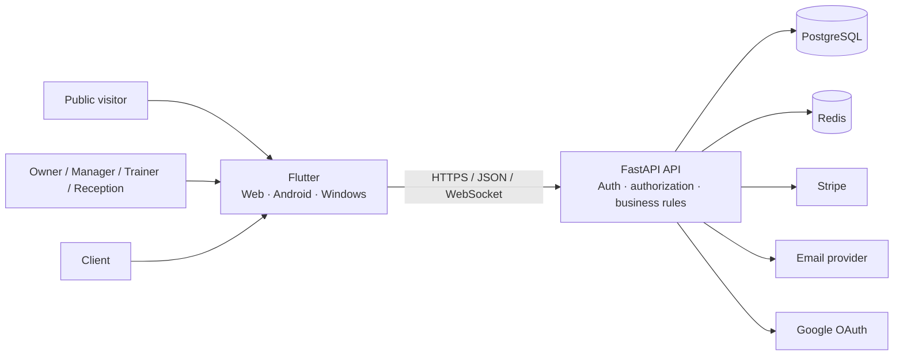

# GymFlow

**A multi-tenant gym operations SaaS built with Flutter, FastAPI, PostgreSQL,
Redis, Stripe, and Docker.**

GymFlow combines a public product site, a role-aware studio application, and a
separate client portal. It connects client lifecycle management, memberships,
services, bookings, attendance, payments, reporting, professional messaging,
staff presence, localization, and release engineering.

> This repository is the private-source project's public engineering case study.
> It contains documentation and reviewed evidence rather than the frontend or
> backend source code. `main` is preparing the `v1.0.1-showcase` evidence release;
> the historical `v1.0.0-showcase` tag predates the current hardening pass.

## At a glance

| Area | Current implementation |
|---|---|
| Product surfaces | Public website, owner/staff application, client portal |
| Roles | Owner, manager, trainer, receptionist, client |
| Core operations | Clients, plans, memberships, services, bookings, check-ins, payments, reports |
| Collaboration | Professional messaging, notifications, activity logs, staff presence |
| Platforms | Flutter Web, Android, Windows |
| Languages | English, French, Arabic with RTL support |
| Backend | FastAPI, SQLAlchemy, Alembic, PostgreSQL, Redis |
| Integrations | Google OAuth, transactional email, Stripe Checkout, Billing, Connect-aware demo behavior, webhooks |
| Delivery | Docker, separate migrations, health checks, validation workflows |

## Product problem

A gym is not only a subscription list. Daily operations connect staff, clients,
memberships, schedules, attendance, payments, communication, and reporting.
GymFlow models those workflows inside one workspace-scoped SaaS system rather
than presenting disconnected CRUD pages.

- Owners need business visibility and workspace administration.
- Managers need broad operational control without ownership-only billing access.
- Trainers need availability, assigned bookings, attendance, and permitted communication.
- Reception staff need fast client, booking, payment, and check-in workflows.
- Clients need private self-service without staff or administrative access.

## Selected product views

### Public experience

### Owner command center

### Connected client lifecycle

### Scheduling and member self-service

### Client portal

### Responsive and RTL presentation

| Mobile portal | Arabic RTL |
|---|---|
|  |  |

The complete evidence inventory is available in the
[GymFlow Visual Gallery](screenshots/README.md).

## Strongest workflows

### Studio command center

The dashboard connects operational totals, revenue and booking signals, recent
activity, workspace readiness, and direct navigation to areas that need action.

### Client lifecycle

One client context brings together identity, membership history, bookings,
check-ins, payments, portal access, and operational notes.

### Scheduling and attendance

Bookings account for service duration, trainer requirements and availability,
recurring series, cancellation, completion, and no-show states. Attendance is
modeled separately through daily-sheet and front-desk check-in/out workflows.

### Payments and SaaS billing

GymFlow separates client-to-studio payments from the studio's subscription to
GymFlow. It models manual collection, Stripe test checkout, receipts, lifecycle
states, billing configuration, webhook verification, and duplicate-event safety.

### Secure communication

Messaging supports role-scoped participants, staff assignment, queue workflow,
priorities, client-visible replies, staff-only notes, cursor pagination,
retry-safe sends, and optimistic conflict handling.

### Presence and client isolation

Staff presence combines connection heartbeats, recent activity, multiple-device
aggregation, and role-aware visibility. The client portal uses a distinct token
and route surface; portal credentials are not staff credentials.

## Architecture preview

The main boundaries are:

1. **Workspace isolation** — business records belong to one studio workspace.
2. **Backend authorization** — frontend permissions improve UX; backend checks remain authoritative.
3. **Separate trust domains** — staff JWTs and portal tokens are intentionally different.
4. **Provider boundaries** — Stripe, email, and OAuth require explicit configuration.
5. **Environment boundaries** — development, test, demo, and production have different safety contracts.

Read the full [architecture case study](ARCHITECTURE.md).

## Engineering evidence

| Competency | Evidence |
|---|---|
| System design | Multi-tenant workspace model, trust boundaries, deployment model |
| Frontend architecture | Feature-oriented Flutter modules, repositories, controllers, route guards |
| Backend architecture | Versioned FastAPI routes, typed schemas, service/query boundaries |
| Relational modeling | SQLAlchemy relationships, constraints, indexes, Alembic history |
| Security | Credential separation, tenant scope, role/resource checks, rate and body limits |
| Reliability | Transactions, idempotency, optimistic concurrency, readiness checks |
| Observability | Request IDs, structured logs, liveness/readiness, provider diagnostics |
| Internationalization | English, French, Arabic, RTL, localized domain values |
| Release engineering | Guarded deterministic data, exact source manifest, media validation |

## Deterministic professional demo

The Northline Performance Club scenario is fictional and reproducible. A guarded
transaction builds connected staff, client, membership, booking, attendance,
payment, messaging, notification, report, and portal stories, validates them,
and commits only after every check succeeds.

The reset refuses unsafe environments, arbitrary or remote databases, live
Stripe configuration, unknown application tables, and missing destructive
confirmation. It never drops schemas or modifies `alembic_version`.

See the [Demo Environment](DEMO.md) and [Build Manifest](BUILD_MANIFEST.md).

## Quality and release evidence

The private source repositories define frontend and backend validation across
PostgreSQL and Redis integration, authorization, migrations, localization,
route synchronization, application behavior, and release builds.

GitHub-hosted jobs for this release line were blocked before checkout by an
account-level spending policy. This repository **does not claim green hosted CI**
for checks that did not run. The final frontend release-quality commands must be
rerun on the canonical frontend revision, and both showcase validators must pass
on the exact commit selected for the next tag.

The current candidate includes no provenance-bound public video, APK, Windows
archive, or other installable binary. Older standalone media is historical and
is not evidence for the current candidate.

## Documentation map

| Document | Purpose |
|---|---|
| [Product](docs/PRODUCT.md) | Users, product areas, and connected workflows |
| [Architecture](ARCHITECTURE.md) | Runtime, trust boundaries, data model, deployment, decisions |
| [Engineering](docs/ENGINEERING.md) | Implementation depth, reliability patterns, trade-offs |
| [Security policy](SECURITY.md) | Private vulnerability reporting |
| [Security overview](docs/SECURITY_OVERVIEW.md) | Implemented controls and privacy boundaries |
| [Threat model](docs/THREAT_MODEL.md) | Threats, mitigations, residual verification |
| [Quality](docs/QUALITY.md) | Risk-to-evidence strategy and validation gates |
| [Operations](docs/OPERATIONS.md) | Configuration, migrations, observability, backup, deployment |
| [Demo](DEMO.md) | Deterministic scenario and destructive-operation safeguards |
| [Release integrity](RELEASES.md) | Versioning, evidence immutability, corrections |
| [Roadmap](ROADMAP.md) | Product evolution and production-operation work |
| [Build manifest](BUILD_MANIFEST.md) | Canonical revisions and candidate artifact record |

## Project ownership

GymFlow was designed and implemented end to end by **Anes** as a demonstration
of full-stack product and software-engineering capability.

## Public repository boundary

This repository intentionally contains no application source, environment file,
credential, real client/staff/payment data, production secret, or installable
binary. Demo identities are fictional and payments remain manual, simulated, or
Stripe test-mode only.

## License

The documentation, branding, screenshots, diagrams, and approved artifacts are
protected by the repository's [license](LICENSE). Viewing and linking are
permitted; reuse or redistribution requires permission unless an artifact states
otherwise.
