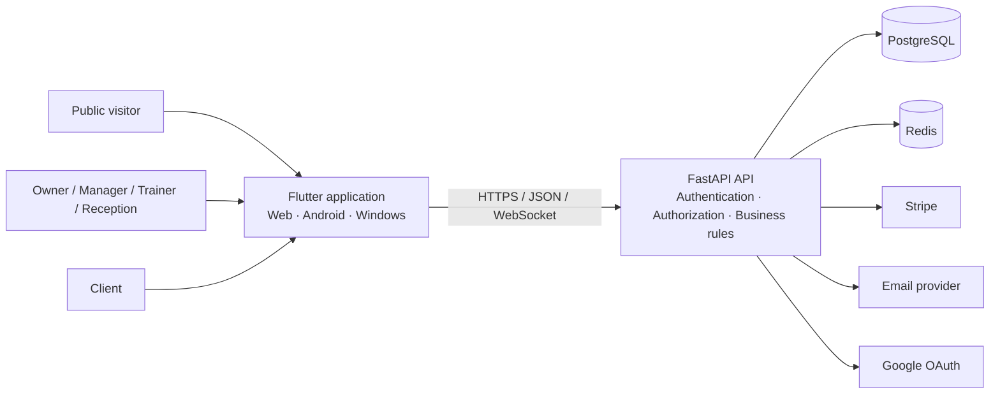

# GymFlow

**A multi-tenant gym operations SaaS built with Flutter, FastAPI, PostgreSQL, Redis, Stripe, and Docker.**

GymFlow combines a public product website, a role-aware studio operations application, and a separate client portal. It covers client lifecycle management, memberships, bookings and attendance, payments, reporting, secure messaging, staff presence, localization, and multi-environment release engineering.

> This repository is the public engineering case study for GymFlow. The frontend and backend source repositories remain private. The documentation, diagrams, 53 tracked screenshots, release evidence, and artifact procedures explain what was built and how it was engineered.

## At a glance

| Area | Current implementation |
|---|---|
| Product surfaces | Public website, owner and staff application, client portal |
| Roles | Owner, manager, trainer, receptionist, client |
| Core operations | Clients, plans, memberships, services, bookings, check-ins, payments, reports |
| Collaboration | Notifications, activity logs, secure messaging, staff presence |
| Platforms | Flutter Web, Android, Windows |
| Languages | English, French, Arabic with RTL support |
| Backend | FastAPI, SQLAlchemy, Alembic, PostgreSQL, Redis |
| Integrations | Google OAuth, Resend-compatible email, Stripe Checkout, Billing, and Webhooks |
| Environments | Development, test, guarded demo, strict production configuration |
| Delivery | Docker, separate migration job, health checks, GitHub Actions workflows |

## Product problem

A gym is not only a subscription list. Daily operations connect staff, clients, memberships, schedules, attendance, payments, communications, and reporting.

GymFlow was designed around those connected workflows:

- owners need business visibility and workspace administration;
- managers need broad operational control without owning billing credentials;
- trainers need availability, assigned bookings, attendance, and client communication;
- reception staff need fast client, booking, payment, and check-in workflows;
- clients need self-service without access to staff or administrative data.

The result is a workspace-scoped SaaS system rather than a single-user CRUD dashboard.

## Strongest workflows

### Studio command center

The dashboard combines operational totals, revenue and booking signals, recent activity, onboarding progress, and shortcuts into the areas that need attention.

### Client lifecycle

A client profile connects identity, membership history, bookings, check-ins, payments, portal access, and operational context.

### Scheduling and attendance

Bookings connect clients, services, trainers, availability, duration, recurring series, cancellations, completion, and no-show states. Attendance supports both a daily sheet and front-desk check-in/check-out workflows.

### Payments and SaaS billing

GymFlow separates client-to-studio payments from the studio's GymFlow subscription. It supports manual collection records, Stripe test checkout, payment lifecycle states, receipts, billing configuration, webhook processing, and duplicate-event protection.

### Secure communication

Staff and client messaging supports role-scoped participants, queue assignment, priorities, internal notes, audience-safe responses, retry-safe sends, cursor pagination, and optimistic workflow updates.

### Presence and real-time behavior

Staff presence distinguishes secure connection heartbeats from user activity, aggregates multiple devices, and applies role-aware visibility for online, away, offline, and last-seen information.

### Client portal

Clients use a separate token and route surface for their own dashboard, bookings, membership, payments, receipts, progress, check-in pass, profile, preferences, support, and messaging. Portal credentials cannot be used as staff credentials.

## Architecture preview

The main design boundaries are:

1. **Workspace isolation** — business records are scoped to one studio workspace.
2. **Role authorization** — frontend permissions improve UX; backend checks remain authoritative.
3. **Separate trust domains** — staff JWTs and client portal tokens are intentionally different.
4. **Provider boundaries** — Stripe, email, and OAuth are configuration-dependent integrations.
5. **Environment boundaries** — development, test, demo, and production have different safety contracts.

Read the full [architecture case study](ARCHITECTURE.md).

## Engineering evidence

| Competency | Evidence in GymFlow |
|---|---|
| Product engineering | Three connected user surfaces and realistic gym operations |
| System design | Multi-tenant workspace model and explicit trust boundaries |
| Frontend architecture | Feature-oriented Flutter modules, repositories, controllers, route guards |
| Backend architecture | Versioned FastAPI routes, service and repository boundaries, Pydantic contracts |
| Relational modeling | SQLAlchemy models, constraints, indexes, foreign keys, Alembic migrations |
| Authentication | Password login, email verification, recovery, OAuth, invitations, portal access |
| Authorization | Role permissions, workspace scoping, resource ownership, portal isolation |
| Reliability | Idempotency, optimistic workflow versions, transactional demo rebuilds |
| Security | Rate limits, request-size limits, CORS, trusted hosts, headers, secret scanning |
| Observability | Request IDs, structured logs, consistent errors, liveness and readiness |
| DevOps | Docker, separate migrations, non-root image, CI workflows, environment contracts |
| Internationalization | English, French, Arabic, RTL, localized enum display |
| Release engineering | Deterministic fictional data, validation, build manifest, screenshot provenance |

More detail is available in [Engineering](docs/ENGINEERING.md), [Quality](docs/QUALITY.md), and [Operations](docs/OPERATIONS.md).

## Environment readiness

| Mode | Status | Purpose |
|---|---|---|
| Development | Ready | Local coding, debug routes, local CORS, provider test configuration |
| Test | Ready | Automated backend and frontend validation workflows |
| Demo | Ready | Dedicated guarded database, deterministic scenario, safe test identities |
| Production configuration | Implemented | Strict settings, non-root container, separate migrations, health checks |
| Live provider verification | Release-specific | Requires real Stripe, email, and OAuth configuration |
| Production operations | Deployment-specific | Requires managed infrastructure, monitoring, backups, and restore drills |

GymFlow is production-oriented. It is not presented as already operating a live commercial gym.

## Deterministic professional demo

The portfolio scenario represents **Northline Performance Club**, a fictional Montréal gym. A guarded rebuild creates:

- 7 staff members across owner, manager, trainer, and reception roles;
- online, away, and offline presence states;
- 24 fictional clients;
- 5 membership plans and 7 services;
- 72 bookings across scheduled, completed, cancelled, and no-show states;
- 58 recent check-ins;
- six months of non-flat revenue history;
- paid, pending, failed, refunded, and cancelled payments;
- notifications, activity history, a support conversation, and two portal stories.

The reset never drops schemas or tables. It requires the demo environment, an approved local database name, Stripe test mode, a reviewed table allowlist, and explicit destructive confirmation. Validation occurs before the transaction is committed.

See the [Demo Guide](DEMO.md).

## Quality and release evidence

The source repositories define comprehensive frontend and backend workflows, including PostgreSQL and Redis integration, static and behavioral contracts, authorization checks, localization checks, route synchronization, application smoke checks, and release builds.

For `v1.0.0-showcase`, GitHub-hosted jobs were blocked before checkout by an account-level spending policy. Equivalent release validation was completed locally, and the build manifest records that limitation explicitly. This repository does not claim green hosted CI for checks that did not execute.

The showcase validator checks required documentation, local links, unsafe file types, stale credentials and source values, common secret patterns, exact release revisions, the 53-screenshot inventory, video boundaries, and release wording.

## Screenshot gallery

This release includes **53 tracked screenshots** across five approved galleries:

- [Desktop application](screenshots/desktop/01-public-home.png) — 22 images;
- [Client portal](screenshots/portal/00-access.png) — 10 images;
- [Mobile experience](screenshots/mobile/01-portal-home.png) — 7 images;
- [Localization and RTL](screenshots/localization/01-arabic-rtl.png) — 4 images;
- [Engineering evidence](screenshots/engineering/07-frontend-project-structure.png) — 10 images.

The complete inventory, naming rules, and provenance requirements are documented in [screenshots/README.md](screenshots/README.md).

## Release media boundary

This release contains the screenshot gallery above. It does **not** include a public walkthrough video, video thumbnail, Android package, Windows archive, or downloadable binary. Future media must be tied to an updated source snapshot and release manifest.

## Documentation map

| Document | Purpose |
|---|---|
| [Product](docs/PRODUCT.md) | Users, product areas, and connected workflows |
| [Architecture](ARCHITECTURE.md) | Containers, trust boundaries, data model, sequences, decisions |
| [Engineering](docs/ENGINEERING.md) | Implementation depth and design trade-offs |
| [Security policy](SECURITY.md) | Private vulnerability reporting |
| [Security overview](docs/SECURITY_OVERVIEW.md) | Application controls and privacy boundaries |
| [Threat model](docs/THREAT_MODEL.md) | Main threats, mitigations, and residual risks |
| [Quality](docs/QUALITY.md) | Test strategy, CI gates, and release evidence |
| [Operations](docs/OPERATIONS.md) | Deployment, migrations, observability, incidents, backups |
| [Engineering journey](docs/ENGINEERING_JOURNEY.md) | Evolution from initial idea to stabilized SaaS system |
| [Demo guide](DEMO.md) | Deterministic environment and walkthrough |
| [Releases](RELEASES.md) | Versioning, artifacts, and distribution boundary |
| [Roadmap](ROADMAP.md) | Current release state and future operational work |
| [Build manifest](BUILD_MANIFEST.md) | Canonical source revisions and artifact provenance |

## Project ownership

GymFlow was designed and implemented end to end by **Anes** as a proof of full-stack software engineering capability.

## Public repository boundary

This repository intentionally does not contain:

- frontend or backend source code;
- environment files or credentials;
- real client, staff, or payment data;
- Stripe, OAuth, email, database, or signing secrets;
- public video or installable binaries in this release.

All demo identities are fictional. Stripe is used only in test or explicitly simulated demo modes. No real payment card data is stored.

## License

The showcase content, branding, screenshots, diagrams, documentation, and any future approved media or downloadable artifacts are protected by the repository's [license](LICENSE). Viewing and linking are permitted; reuse or redistribution requires permission unless a specific artifact states otherwise.
