# GymFlow

GymFlow is a full-stack SaaS gym management platform built to demonstrate end-to-end software engineering across frontend development, backend API design, relational databases, authentication, payments, role-based access control, client portals, responsive UI, localization, quality assurance, and demo release preparation.

The project was built as a product-style application, not as a small tutorial app. It combines public marketing pages, an owner/staff dashboard, a client portal, payment flows, booking workflows, reports, settings, localization, and production-oriented backend contracts.

---

## Project Purpose

GymFlow was created as a proof-of-capability project.

The goal is to show the ability to design, build, stabilize, and present a complete SaaS-style software product across multiple engineering domains.

This showcase repository contains the public presentation material for the project.

The frontend and backend source repositories remain private because GymFlow is a complete product-style application.

---

## Product Summary

GymFlow helps gyms and fitness studios manage their daily operations.

The application includes:

| Area | Description |
|---|---|
| Public Website | Landing page, features, pricing, security, contact, privacy, and terms pages |
| Authentication | Email login, Google OAuth, email verification, password reset, and invitation flows |
| Dashboard | Studio overview, business metrics, activity, and operational summaries |
| Clients | Client records, profiles, memberships, bookings, payments, and portal actions |
| Memberships | Membership plans, client memberships, renewals, statuses, and plan management |
| Staff | Owners, managers, trainers, receptionists, invitations, and trainer availability |
| Bookings | Scheduling, trainer availability, service types, recurring bookings, cancellation flows |
| Check-ins | Daily attendance, front-desk check-in/out, and saved attendance visibility |
| Payments | Manual payments, Stripe test checkout flows, receipts, statuses, and payment history |
| Billing | SaaS billing settings, Stripe test billing, and Stripe Connect demo mode |
| Reports | Business reporting foundation with date filters, grouping, and CSV export support |
| Notifications | User-facing notifications and status management |
| Activity Logs | Operational audit trail and readable activity history |
| Client Portal | Client-facing dashboard, bookings, membership, payments, receipts, profile, progress, and support |
| Localization | English, French, and Arabic UI support |
| QA | Automated checks and manual QA checklist for demo readiness |

---

## Technical Stack

| Layer | Technology |
|---|---|
| Frontend | Flutter and Dart |
| Frontend Routing | go_router |
| Frontend Persistence | shared_preferences |
| Frontend Localization | Flutter AppLocalizations and ARB files |
| Backend | Python and FastAPI |
| Database | PostgreSQL |
| ORM | SQLAlchemy |
| Migrations | Alembic |
| Authentication | JWT authentication |
| OAuth | Google OAuth |
| Payments | Stripe Test Mode and Stripe Connect demo mode |
| Email | Transactional email provider support |
| Quality | Static checks, contract checks, smoke checks, and manual QA |

---

## Supported App Surfaces

GymFlow is designed to run across multiple user surfaces.

| Surface | Status |
|---|---|
| Flutter Web | Main showcase surface |
| Android APK | Build/demo surface |
| Windows Desktop | Build/demo surface |
| Local Backend | FastAPI API server |
| Local Database | PostgreSQL |
| Optional Hosted Demo | Can be enabled during review periods |

---

## Main User Roles

GymFlow is not a single-user app. It supports different user experiences depending on role.

| Role | Purpose |
|---|---|
| Owner | Full studio and workspace administration |
| Manager | Operational management across the workspace |
| Trainer | Booking, availability, and attendance-related workflows |
| Receptionist | Front-desk client and check-in workflows |
| Client | Private client portal access |

The client portal is separated from the owner/staff dashboard to protect administrative data and provide a client-safe experience.

---

## Backend Scope

The backend is built with FastAPI and PostgreSQL.

Implemented backend areas include:

| Backend Area | Description |
|---|---|
| Auth | Login, registration, JWT access, password recovery, email verification |
| Google OAuth | OAuth handoff and provider integration foundation |
| Workspaces | Studio workspace model and workspace-aware access |
| Workspace Members | Owner/staff membership inside a workspace |
| Staff Invitations | Invitation flow for workspace team members |
| Clients | Client records and client lifecycle management |
| Client Portal Access | Portal access request and confirmation flows |
| Membership Plans | Studio-level membership plan management |
| Client Memberships | Assignment and status tracking of client memberships |
| Staff and Trainers | Staff management and trainer-specific workflows |
| Trainer Availability | Availability rules used by booking workflows |
| Service Types | Services/classes that can be booked |
| Bookings | Booking creation, editing, cancellation, and recurring booking support |
| Check-ins | Attendance and front-desk check-in/out flows |
| Payments | Payment records, statuses, receipts, and checkout coordination |
| SaaS Billing | Subscription-oriented billing configuration |
| Stripe Webhooks | Payment/billing synchronization hooks |
| Reports | Reporting endpoints and CSV export support |
| Notifications | User-facing notification records |
| Activity Logs | Operational audit history |
| Health and Readiness | Health checks for local/demo/deployment readiness |

---

## Frontend Scope

The frontend is built with Flutter and organized around public, admin/staff, and client portal experiences.

Main frontend routes include:

| Route Area | Examples |
|---|---|
| Public Website | Home, features, pricing, security, contact, privacy, terms |
| Authentication | Auth, forgot password, reset password, verify email, Google OAuth callback |
| Invitations | Staff invitation acceptance |
| Studio Dashboard | Dashboard, clients, memberships, services, staff, bookings, check-ins |
| Operations | Payments, reports, activity logs, notifications |
| Settings | Workspace, account, billing settings |
| Client Portal | Portal access, portal home, bookings, membership, payments, receipts, profile, progress, support |

The frontend includes responsive layouts, localized UI text, role-aware navigation, portal-specific UI states, and demo-ready product flows.

---

## Client Portal

The client portal is one of the most important parts of GymFlow.

It gives clients a dedicated experience separate from the studio dashboard.

Client portal functionality includes:

| Portal Feature | Description |
|---|---|
| Portal Access | Client access request and confirmation |
| Portal Home | Client-specific summary and next actions |
| Portal Bookings | Upcoming bookings, history, booking actions, cancellation/reschedule flows |
| Portal Membership | Membership status, benefits, and pass information |
| Portal Payments | Pending payments, paid payments, and checkout access |
| Portal Receipts | Safe receipt display |
| Portal Profile | Client profile details |
| Portal Progress | Demo-ready progress experience |
| Portal Support | Support path for client-facing issues |
| QR Pass | Client check-in pass concept for front-desk workflows |

---

## Payments and Billing

GymFlow includes payment and billing flows built around Stripe test mode.

For showcase safety:

| Payment Area | Showcase Behavior |
|---|---|
| Stripe Checkout | Uses Stripe Test Mode |
| Stripe Test Card | Supported |
| Client Payments | Can be demonstrated without real money |
| SaaS Billing | Demo/test billing flow supported |
| Stripe Connect | Uses demo mode in showcase |
| Identity Verification | Not required for the demo |
| Real Payments | Not processed |

Stripe Connect demo mode prevents reviewers from being sent into a real identity verification process while still allowing the payment-related product flow to be shown.

---

## Localization

GymFlow supports:

| Language | Status |
|---|---|
| English | Supported |
| French | Supported |
| Arabic | Supported |

The frontend uses Flutter localization files and display helpers so that backend values such as statuses, roles, payment methods, and billing states are not shown as raw internal enum values.

---

## Quality and QA

GymFlow includes both automated and manual quality gates.

Backend quality areas include:

| Area | Purpose |
|---|---|
| Secret checks | Avoid committed secrets |
| Migration checks | Protect database migration integrity |
| DB contract checks | Validate model and database expectations |
| Security contract checks | Validate security-sensitive behavior |
| Deployment contract checks | Validate production configuration expectations |
| API contract checks | Validate critical route and OpenAPI behavior |
| Route auth checks | Validate protected route expectations |
| Portal route checks | Validate portal API availability |
| Smoke checks | Confirm application import and route registration |
| Pytest | Backend behavior verification |

Frontend quality areas include:

| Area | Purpose |
|---|---|
| Flutter analyze | Static Dart and Flutter validation |
| Frontend quality checks | Source and UI consistency checks |
| API sync tests | Frontend/backend integration expectations |
| Portal quality checks | Client portal privacy, layout, and behavior checks |
| Full frontend test runner | Grouped test execution with readable logs |
| Manual QA checklist | Full product review across roles, routes, languages, and screen sizes |

Manual QA covers public site, auth, onboarding, admin dashboard, clients, memberships, services, staff, bookings, check-ins, payments, reports, notifications, activity logs, settings, client portal, security behavior, provider flows, responsive layouts, localization, and final demo readiness.

---

## Demo Strategy

The recommended showcase strategy is:

| Asset | Purpose |
|---|---|
| Screenshots | Show the product visually without exposing source code |
| Demo Video | Walk through the main workflows and engineering scope |
| Architecture Notes | Explain how the system is designed |
| Security Notes | Explain authentication, authorization, workspace isolation, and demo safety |
| APK / Windows Build | Optional installable demo artifacts |
| Temporary Hosted Demo | Optional access during review periods |

The showcase is designed to prove the application exists, works, and was engineered seriously without exposing the full private codebase.

---

## Repository Boundary

This repository is public-facing showcase material only.

It does not contain:

| Not Included | Reason |
|---|---|
| Frontend source code | Private product-style application code |
| Backend source code | Private product-style API code |
| Environment files | Protect secrets and credentials |
| Database credentials | Protect local and hosted environments |
| Stripe secret keys | Protect payment configuration |
| OAuth secrets | Protect provider credentials |
| Email provider keys | Protect email infrastructure |

Code walkthrough or temporary read-only source access can be provided upon request.

---

## Current Showcase Status

| Item | Status |
|---|---|
| Product architecture | Documented |
| Demo guide | In progress |
| Security notes | In progress |
| Screenshots | To be added |
| Demo video | To be recorded |
| APK build notes | To be added |
| Windows build notes | To be added |
| Optional hosted demo | Available on request after final preparation |

---

## Final Positioning

GymFlow demonstrates software engineering across:

- Full-stack SaaS architecture.
- Flutter frontend development.
- FastAPI backend development.
- PostgreSQL database modeling.
- Alembic migration workflows.
- JWT authentication.
- Google OAuth integration.
- Role-based access control.
- Workspace isolation.
- Client portal separation.
- Stripe test payments.
- Stripe Connect demo handling.
- Email verification and reset flows.
- Booking and recurring booking logic.
- Check-in and attendance workflows.
- Reports and CSV exports.
- Responsive UI.
- Localization.
- Automated quality gates.
- Manual QA discipline.
- Demo and release preparation.

---

## Screenshots

### Public Website

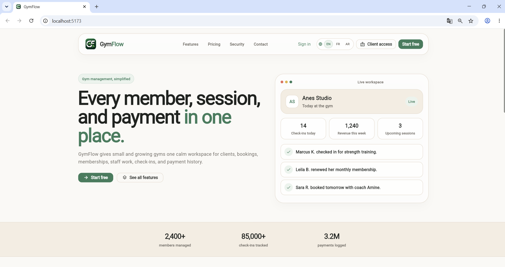

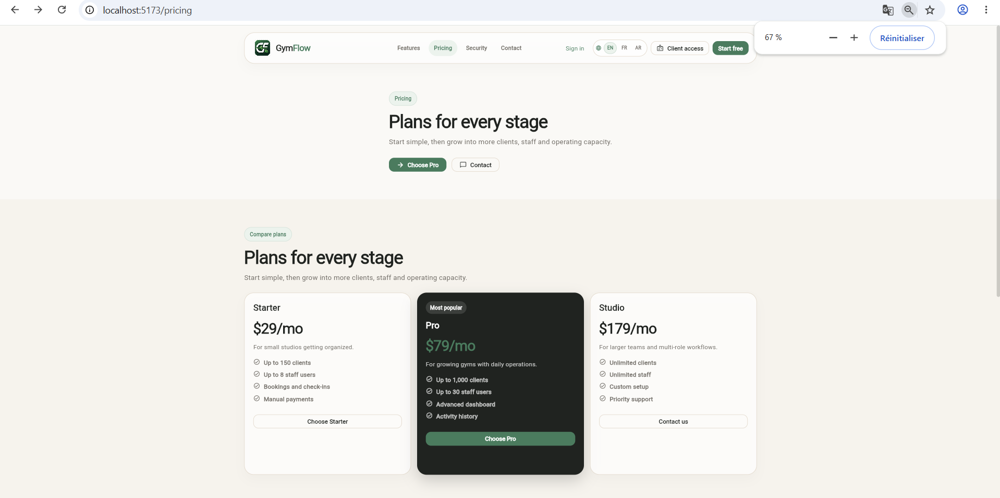

### Authentication

### Owner and Staff Dashboard

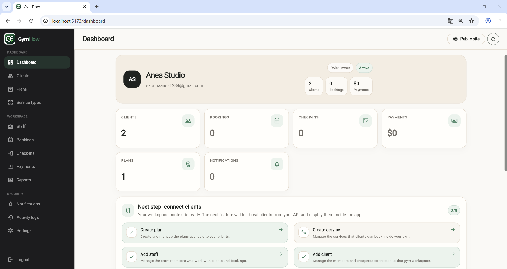

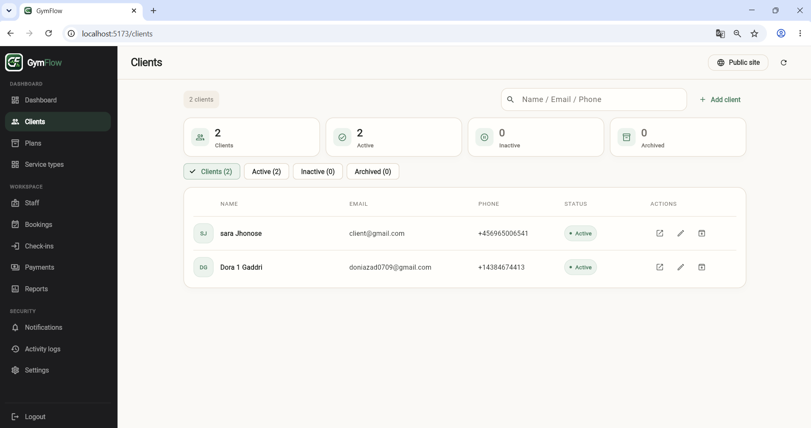

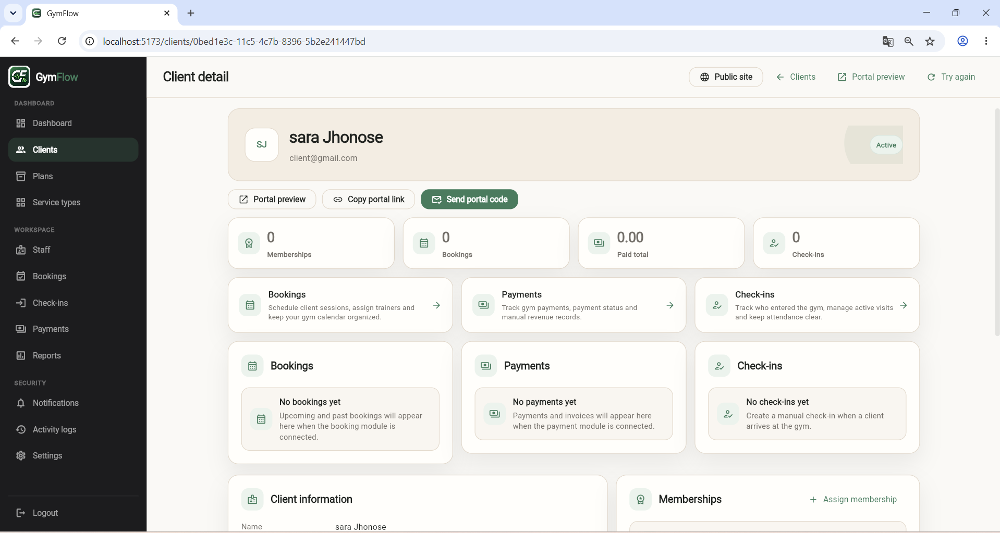

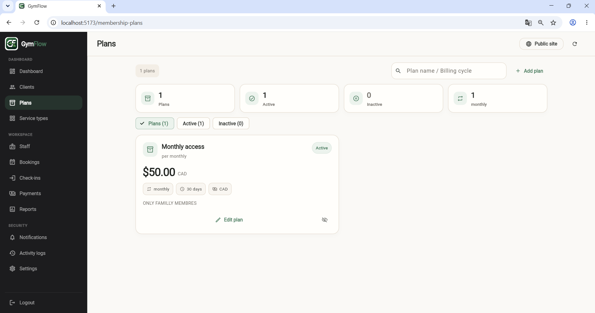

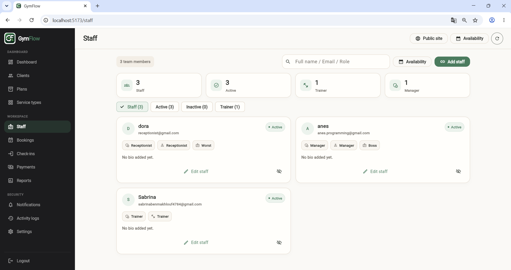

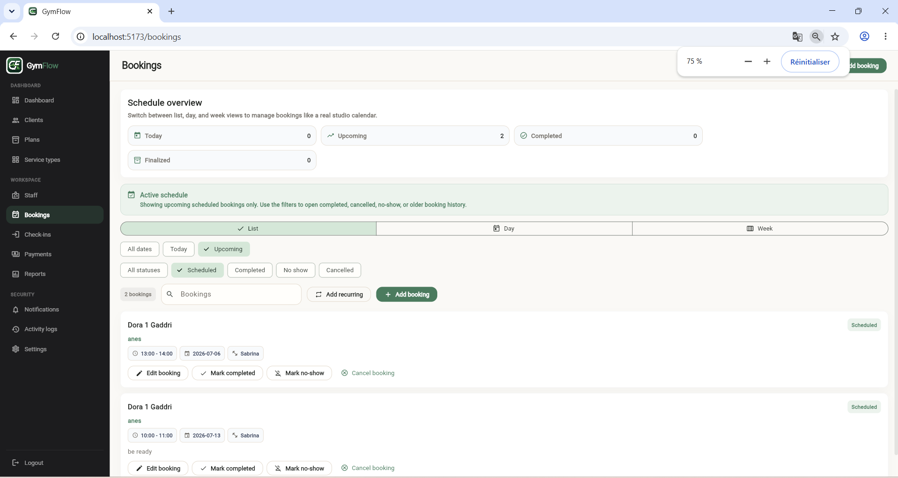

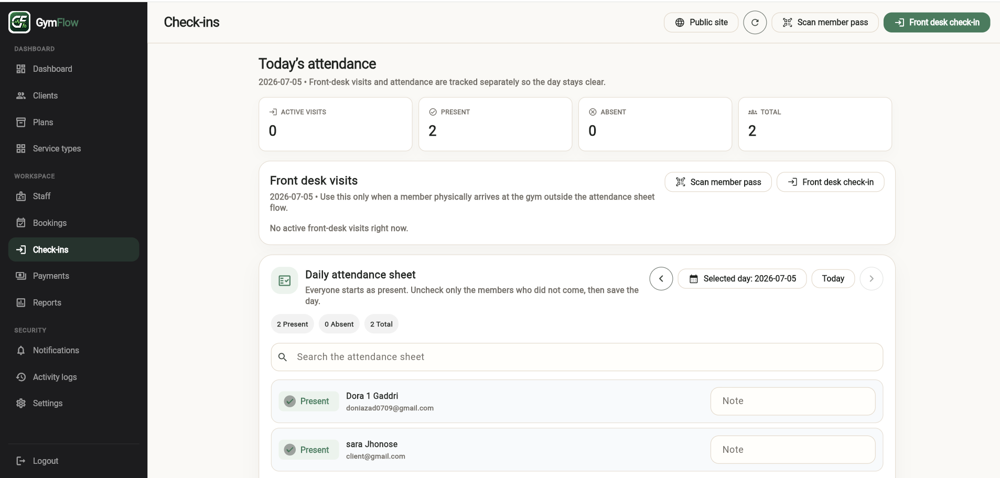

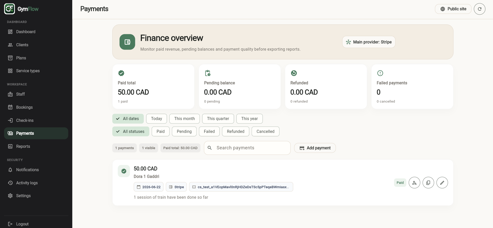

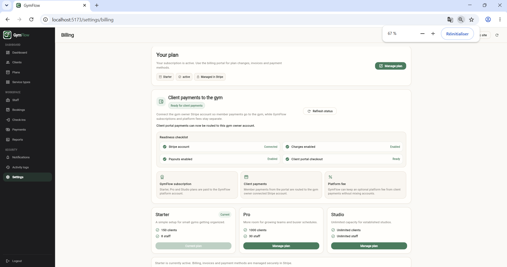

### Client Portal

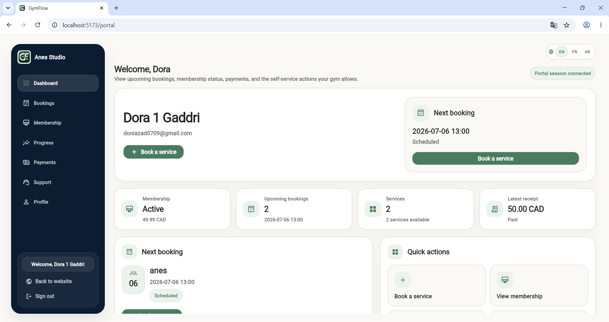

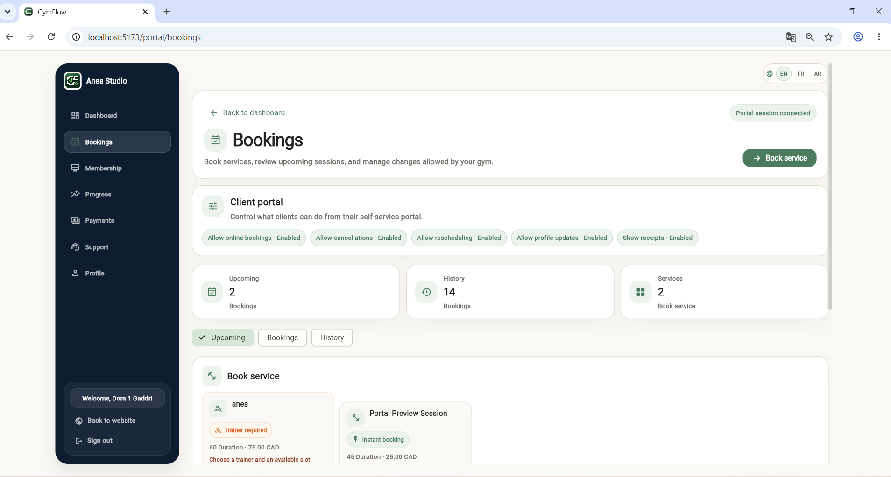

### Mobile and Localization

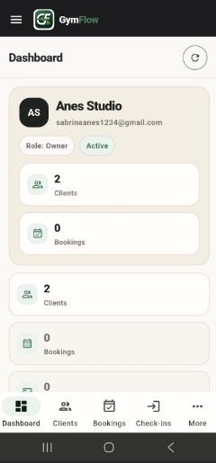

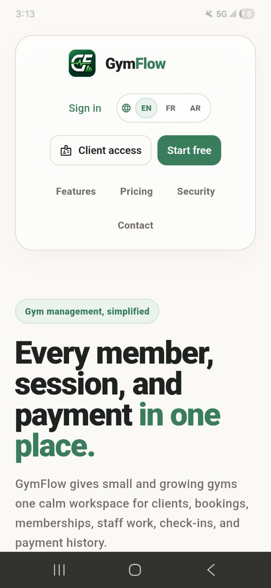

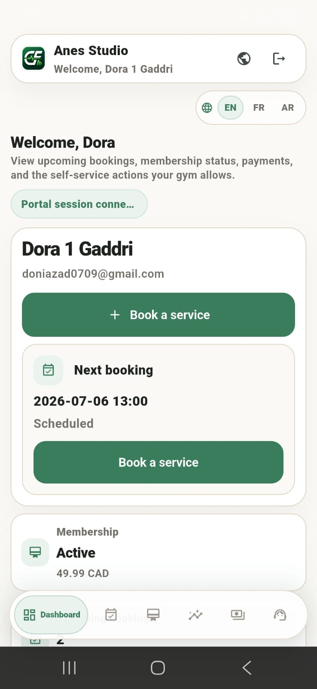

