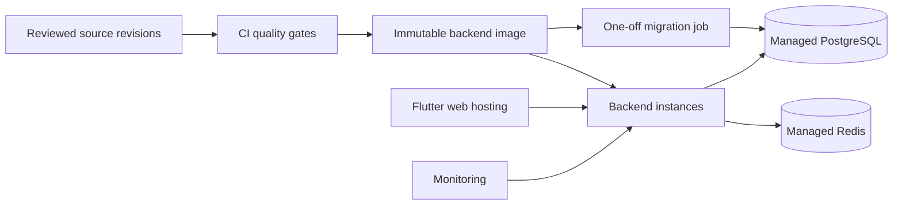

# GymFlow Operations

This document describes how GymFlow is packaged, configured, migrated, observed, demonstrated, and prepared for production operations.

It distinguishes implemented delivery architecture from deployment-specific work that must be completed before a live commercial launch.

## Operating modes

| Mode | Database/runtime | Main use |
|---|---|---|
| Development | Local `gymflow` PostgreSQL database | Feature development and debugging |
| Test | Isolated CI database and Redis | Automated verification |
| Demo | Dedicated `gymflow_demo` database | Repeatable portfolio review and recording |
| Production | Managed PostgreSQL and Redis | Hosted commercial operation after final verification |

## Configuration philosophy

Configuration is validated at startup. Production is expected to fail fast when required settings are incomplete or unsafe.

Important categories:

- application environment;
- database and Redis connectivity;
- JWT signing;
- frontend URL, CORS, and trusted hosts;
- OAuth metadata and redirects;
- email provider and sender identity;
- Stripe provider, mode, secrets, and price identifiers;
- debug/docs exposure;
- runtime workers and ports.

Secrets remain outside Git and showcase assets.

## Local Docker stack

The local Compose stack runs:

- FastAPI backend;
- PostgreSQL;
- Redis.

A single selector chooses the approved local database:

```dotenv
GYMFLOW_DATABASE=gymflow
```

or:

```dotenv
GYMFLOW_DATABASE=gymflow_demo
```

Then the normal command is used:

```powershell
docker compose up --build -d
```

The selector only accepts the two reviewed local names. It is not arbitrary dynamic SQL.

### Data preservation rule

Use:

```powershell
docker compose down
```

Do not use `docker compose down -v` unless intentionally deleting all local PostgreSQL/Redis volumes.

## Production container

The backend production image:

- uses a slim Python base image;
- installs dependencies during build;
- copies only required application, migration, and script paths;
- runs as the non-root `gymflow` user;
- exposes port 8000;
- uses `/api/v1/health/ready` as its health check;
- starts through an explicit web-start script.

## Separate migration job

Production migrations are intentionally separate from the web process.

Recommended order:

1. run repository quality checks;
2. build the immutable backend image;
3. execute the migration job once;
4. start or roll application containers;
5. verify liveness and readiness;
6. verify frontend/API connectivity;
7. verify provider callbacks where enabled.

Separating migrations prevents every web restart from silently changing schema state.

## Health model

### Liveness

```text
GET /api/v1/health/live
```

Answers: “Is the process running?”

### Readiness

```text
GET /api/v1/health/ready
```

Answers: “Can this instance safely receive traffic?”

Readiness includes non-secret runtime context and required dependency status. It returns `503` if PostgreSQL or required production Redis is unavailable.

Health payloads must never expose:

- database URLs;
- Redis URLs;
- secret keys;
- Stripe keys;
- webhook secrets;
- email provider keys.

## Structured logging

Every request receives an `X-Request-ID`.

Access logs include:

- timestamp;
- log level;
- logger;
- message;
- request ID;
- method;
- path;
- status code;
- duration;
- client IP/context.

Unhandled exceptions are logged with stack context on the server, while clients receive a generic error and request ID.

## Incident correlation

When a frontend action fails:

1. capture the `X-Request-ID` from the response or error context;
2. search backend logs for that request ID;
3. review path, method, status, and duration;
4. inspect the corresponding error event for a 500;
5. verify the active environment and selected database;
6. reproduce only with fictional/test data.

## Provider diagnostics

### Stripe webhooks

Operational events distinguish:

- processed;
- ignored;
- duplicate.

Useful fields include:

- event type;
- Stripe event/object identifiers;
- workspace/client/entity context;
- processing status;
- duplicate flag.

Troubleshooting order:

1. confirm provider mode and webhook secret;
2. confirm signature verification succeeded;
3. search by event ID;
4. inspect stored webhook event state;
5. confirm required metadata;
6. confirm whether delivery was classified as duplicate.

### Email

Verify:

- provider enabled state;
- verified sender domain;
- sender address;
- recipient policy;
- neutral public API response;
- delivery/provider logs.

The guarded demo intentionally does not attempt real delivery to reserved `.test` identities.

### Google OAuth

Verify:

- web and Android client identifiers;
- backend callback URL;
- frontend handoff URL;
- HTTPS in production;
- package name and signing fingerprint for Android;
- expired/missing handoff behavior.

## Deterministic demo operations

### Safety prerequisites

The demo rebuild refuses to execute unless:

- environment is `demo`;
- database is `gymflow_demo` or an approved `_demo` name;
- host is local/Docker PostgreSQL;
- Stripe is in test mode;
- no live Stripe key or live stored webhook event exists;
- every application table is in the reviewed allowlist;
- exact confirmation is supplied.

### Transaction flow

1. inspect current migration and schema contract;
2. acquire PostgreSQL advisory transaction lock;
3. delete approved data in foreign-key-safe order;
4. seed Northline Performance Club;
5. validate relationships, metrics, reports, payments, presence, and portal stories;
6. commit only after all validation succeeds.

A failure rolls back the transaction.

### Demo preflight

- start stack against `gymflow_demo`;
- rebuild with explicit confirmation and local password;
- run validation;
- verify owner login;
- check dashboard and reports;
- check staff presence;
- request fresh portal code;
- review logs for repeated 404/422/500 responses;
- record source revisions and Alembic head;
- only then capture screenshots/video.

## Production deployment model



## Production deployment checklist

### Infrastructure

- hosted Flutter web frontend with HTTPS;
- backend container platform with HTTPS/proxy support;
- managed PostgreSQL;
- managed Redis;
- private network/firewall rules;
- managed secrets;
- domain and certificate configuration.

### Application configuration

- `ENVIRONMENT=production`;
- strong unique secret;
- exact frontend URL and CORS origin;
- explicit backend allowed host;
- debug/docs disabled;
- production provider configuration complete or providers disabled;
- test/live Stripe values never mixed.

### Database

- backup before migration;
- migration graph checks pass;
- one migration head;
- migration job succeeds;
- application readiness confirms schema compatibility;
- rollback/forward-fix decision documented.

### Verification

- liveness returns 200;
- readiness returns 200 with database and Redis healthy;
- staff login and workspace access work;
- portal token isolation works;
- CORS exposes request ID only to expected frontend;
- provider callbacks work;
- logs contain request correlation without secrets.

## Backup and restore plan

A production operator should define:

- database backup frequency;
- point-in-time recovery availability;
- retention period;
- encryption at rest and in transit;
- responsible owner;
- restore target environment;
- restore validation checklist;
- documented recovery-time and recovery-point objectives.

### Restore drill

At minimum:

1. select a known backup;
2. restore into an isolated database;
3. run Alembic/current schema verification;
4. run application readiness;
5. verify representative workspace, client, booking, payment, and portal data;
6. document duration and failures;
7. destroy isolated restore when review is complete.

A backup is not operationally trusted until a restore has been tested.

## Monitoring and alerting plan

Recommended signals:

| Signal | Example alert |
|---|---|
| Readiness | Consecutive 503 responses |
| HTTP errors | Elevated 5xx rate |
| Latency | P95/P99 request duration increase |
| Authentication | Sudden failed-login/rate-limit increase |
| Database | Connection failures or saturation |
| Redis | Unavailable required dependency |
| Stripe | Webhook failures or growing unprocessed events |
| Queue/messaging | Stuck high-priority conversations |
| Backups | Missed backup or failed restore verification |
| Certificate/domain | Expiry or routing failure |

## Scaling considerations

The architecture supports horizontal API instances when:

- rate-limit state is shared in Redis;
- database connection pooling is configured for platform limits;
- WebSocket/realtime routing is supported by the hosting platform;
- migrations remain one-off jobs;
- local process memory is not treated as durable shared state.

Likely future pressure points:

- report aggregation on large workspaces;
- message/presence fan-out;
- booking conflict queries;
- payment/webhook throughput;
- audit-log retention;
- database index and archival strategy.

## Supply-chain and release operations

The release roadmap includes:

- dependency update automation;
- dependency review;
- SAST/CodeQL;
- container vulnerability scanning;
- minimal GitHub Actions permissions;
- pinned action versions/SHAs;
- SBOM generation;
- artifact checksums;
- provenance/signing where practical.

These controls should only be marked completed after they are enabled and verified.

## Do not deploy when

- source quality pipeline is failing;
- migration graph or database contract fails;
- secret scan reports a real credential;
- production settings validation fails;
- container health check fails;
- readiness returns 503;
- CORS includes local/wildcard origins;
- trusted hosts include wildcard/local hosts;
- Stripe is enabled with test keys in production mode;
- provider callbacks have not been verified for the target environment;
- no current backup exists before a risky migration.

## Operational ownership boundary

The repository implements production-oriented packaging, configuration checks, health endpoints, and runbooks. A real launch still requires an operator to select and configure infrastructure, providers, monitoring, backups, and incident contacts for the target organization.
