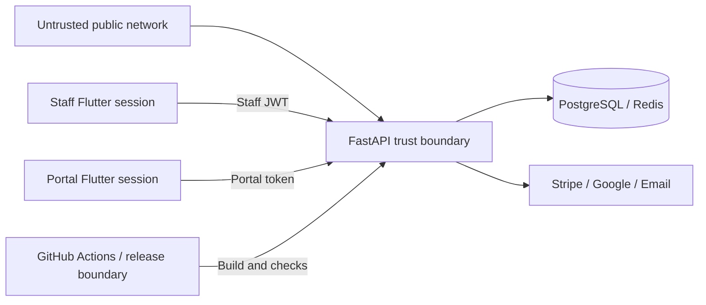

# GymFlow Threat Model

This threat model summarizes the main assets, actors, trust boundaries, threats, implemented mitigations, and residual risks in GymFlow.

It is intended to demonstrate security-aware design and guide verification. It is not a penetration-test report or compliance certification.

## Scope

Included:

- public website and authentication routes;
- owner/staff dashboard;
- client portal;
- FastAPI API;
- PostgreSQL and Redis;
- Google OAuth, email, and Stripe integration boundaries;
- Docker and CI release paths;
- deterministic demo environment;
- public showcase and downloadable artifacts.

Excluded:

- vulnerabilities in Stripe, Google, GitHub, email, hosting, or operating-system providers themselves;
- unauthorized testing of third-party or production infrastructure;
- physical security and personnel procedures outside the application.

## Primary assets

| Asset | Why it matters |
|---|---|
| Staff credentials and JWTs | Permit workspace operations |
| Client portal tokens | Permit access to one client's private portal |
| Workspace business data | Contains clients, schedules, memberships, payments, and operations |
| Client identity/contact data | Personally identifying business records |
| Payment and billing state | Financial correctness and receipts |
| Internal messages and notes | May contain staff-only operational context |
| Presence and last-seen data | Reveals staff availability and work patterns |
| Provider credentials | Grant access to Stripe, email, and OAuth services |
| Database and Redis credentials | Protect durable and runtime state |
| Migration history | Protects schema integrity |
| Demo reset capability | Can intentionally delete approved demo data |
| Release artifacts | Must correspond to the documented source state |

## Actors

| Actor | Trust level |
|---|---|
| Public visitor | Untrusted |
| Registered but unauthorized user | Authenticated, not trusted for arbitrary workspaces |
| Owner | Highly privileged within owned workspace |
| Manager | Broad operational privilege |
| Trainer | Limited operational privilege |
| Receptionist | Front-desk privilege |
| Client portal user | Trusted only for one client scope |
| External provider | Trusted only through validated protocol/configuration |
| Developer/operator | Privileged; must follow environment and secret controls |
| Attacker | May be anonymous, authenticated, automated, or malicious insider |

## Trust boundaries

Important boundaries:

- browser/application to API;
- staff token to portal token;
- workspace A to workspace B;
- API to data stores;
- API to external providers;
- local/test/demo to production;
- private source to public showcase artifacts.

## Threat register

| ID | Threat | Asset / entry point | Implemented mitigations | Residual risk / verification |
|---|---|---|---|---|
| T01 | Cross-workspace data access | Workspace APIs | Membership dependencies, workspace-scoped queries, role checks, isolation tests | Every new query must preserve workspace scope |
| T02 | Portal token accesses staff routes | Staff APIs | Separate credential type and route dependencies | Regression possible if a route uses the wrong dependency |
| T03 | Staff JWT accesses protected portal data | `/portal/me...` | Portal-only token dependency | Test every newly added portal route |
| T04 | Client changes workspace/client query parameters | Portal APIs | Token-derived identity after access confirmation | Preview/debug modes must remain environment guarded |
| T05 | Role escalation through frontend request | Mutating workspace routes | Backend authorization independent of hidden UI | Permission matrix must stay synchronized |
| T06 | Account/client enumeration | Recovery and portal access | Neutral responses and consistent public behavior | Timing and provider side effects require review |
| T07 | Brute-force login/code guessing | Public auth/portal routes | Redis-backed rate limits, attempt limits, expiry | Distributed attacks require production Redis and monitoring |
| T08 | Oversized body/resource exhaustion | Sensitive public POST routes | Pre-parse request-size middleware | Non-covered endpoints still need normal platform limits |
| T09 | Weak or leaked JWT secret | Environment configuration | Production settings reject weak secrets; no committed env files | Operator secret management and rotation remain required |
| T10 | Unsafe OAuth redirect or handoff | Google callback | Exact configured redirects, HTTPS production validation, safe frontend target handling | Provider console must match deployed URLs |
| T11 | Password reset token reuse | Reset flow | Expiring token records and consumption semantics | Requires ongoing behavior tests |
| T12 | Portal code reuse | Portal access | Hashed, expiring, one-time records and attempt limits | Clock/config errors or race regressions |
| T13 | Internal staff note exposed to client | Messaging responses | Audience-specific schemas and authorization tests | New fields must be reviewed for audience safety |
| T14 | Unauthorized conversation access | Messaging | Participant checks, role/assignment restrictions | Assignment transitions require regression tests |
| T15 | Duplicate message send | Messaging POST | Retry-safe/idempotency key behavior | Client retries must consistently reuse identifiers |
| T16 | Lost update in conversation workflow | Queue/priority/status changes | Optimistic workflow version | UI must handle conflict responses clearly |
| T17 | Presence privacy leak | Staff presence endpoints | Role-aware visibility and settings | Policy configuration and screenshots must be reviewed |
| T18 | Presence incorrectly marks person offline | Multi-device heartbeat | Connection aggregation and explicit lifecycle semantics | Network partitions and background browser behavior |
| T19 | Forged Stripe webhook | Webhook endpoint | Signature verification and configured secret | Secret rotation and endpoint configuration |
| T20 | Duplicate webhook corrupts payment state | Webhook delivery | Stored event IDs, duplicate detection, idempotent updates | New event handlers need duplicate tests |
| T21 | Test/live Stripe mix-up | Environment configuration | Mode/key validation and demo live-data refusal | Production provider configuration must be verified manually |
| T22 | Real payment data enters demo | Demo workflow | Fictional records, no card storage, test-mode guards | Operator must never enter real cards |
| T23 | Email provider leaks existence | Recovery/access flow | Neutral API responses and provider-safe behavior | Delivery timing may still differ |
| T24 | SQL/schema corruption during release | Migrations | Alembic graph checks, separate migration job, DB contract tests | Backup and rollback/forward-fix plan required |
| T25 | Demo reset targets wrong database | Reset command | Demo environment, approved name/host, confirmation, allowlist, Stripe guards | Operator credentials still have power; never bypass wrapper |
| T26 | Demo reset deletes unknown/new table | Schema evolution | Refuse unknown `gymflow_*` tables until allowlist reviewed | Allowlist must be updated intentionally with migrations |
| T27 | Concurrent demo rebuild | Seed/reset | PostgreSQL advisory transaction lock | Lock scope must remain part of contract |
| T28 | Secret committed to source/showcase | Git/release assets | Secret scanners, ignored env files, showcase checks | Scanners are pattern-based; review remains required |
| T29 | Sensitive data in logs | API/logging | Structured allowlisted metadata, generic client errors, no secret health fields | New logging fields require review |
| T30 | Host/CORS misconfiguration | Browser/API boundary | Production trusted-host and HTTPS origin validation | Deployment configuration must use exact domains |
| T31 | Clickjacking/content sniffing | API responses | Security headers and restrictive production policy | Frontend hosting needs its own header configuration |
| T32 | Debug/docs exposed in production | Backend routes | Production settings disable debug, OpenAPI, Swagger, ReDoc | Verify deployed environment, not only source |
| T33 | Compromised dependency/action | Build pipeline | Pinned package manifests, CI, planned dependency/image scanning | Supply-chain controls require continuous maintenance |
| T34 | Tampered downloadable artifact | Showcase release | Planned checksums, build manifest, exact source revisions | Signatures/provenance should be added for public binaries |
| T35 | Screenshots expose private data | Showcase assets | Fictional deterministic data and capture checklist | Manual review before publication |

## Abuse cases by surface

### Public authentication

- automated credential guessing;
- enumeration through response differences;
- malformed or oversized requests;
- unsafe redirect targets;
- reuse of verification/recovery credentials.

### Staff dashboard

- role escalation;
- cross-workspace object access;
- unsafe destructive actions;
- exposing raw provider/internal identifiers;
- stale sessions after account or membership changes.

### Client portal

- guessing or replaying access codes;
- client switching identity through parameters;
- portal token used against staff APIs;
- receipt or message data belonging to another client;
- internal-note leakage.

### Payments

- forged or replayed webhooks;
- duplicate state transitions;
- test/live configuration confusion;
- storing sensitive card information;
- unauthorized refunds or collection actions.

### Demo and release

- destructive command against development/production;
- stale screenshots or credentials;
- accidental source or secret publication;
- release artifact not matching documented commits.

## Security assumptions

The architecture assumes:

- TLS is terminated correctly in hosted environments;
- production secrets are managed outside Git;
- PostgreSQL and Redis are not publicly exposed;
- the email, OAuth, and Stripe accounts are configured according to provider guidance;
- the operator does not bypass environment guards;
- CI branch protection and review settings are configured appropriately when the repositories are opened to collaborators.

## Verification priorities

### Before every showcase release

- scan repository and assets for secrets;
- confirm all identities are fictional;
- validate demo database target and metrics;
- test staff/portal isolation;
- test role restrictions;
- verify no repeated 4xx/5xx errors in the walkthrough;
- inspect screenshots and video frames for tokens, local paths, or private data;
- record exact source revisions.

### Before production deployment

- run provider end-to-end tests;
- verify exact CORS and trusted hosts;
- verify docs/debug routes are disabled;
- verify Redis-backed rate limits;
- run workspace/portal isolation tests against the deployed build;
- scan dependencies and container image;
- configure monitoring and alerting;
- run database backup and restore drill;
- document secret rotation and incident contacts.

## Risk acceptance boundary

The public portfolio release accepts that:

- it demonstrates test/demo payments rather than real financial operation;
- live email and OAuth depend on the configured review environment;
- public source code is not provided;
- production infrastructure operations are deployment-specific.

It does not accept exposing real identities, real payment data, credentials, cross-tenant access, or misleading claims about provider verification.
