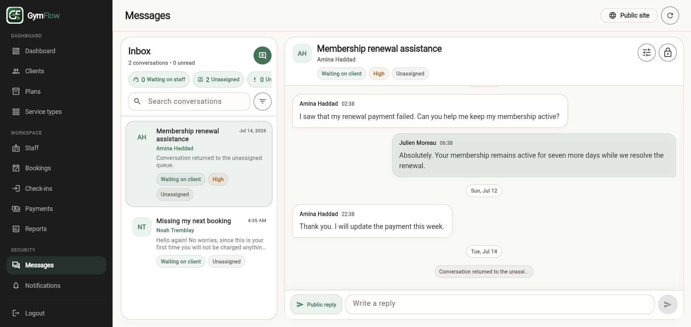

# GymFlow Visual Gallery

The `v1.0.0-showcase` release includes **53 screenshots** tied to the exact
frontend and backend revisions recorded in the
[build manifest](../BUILD_MANIFEST.md).

The gallery documents the product across desktop, client portal, mobile,
localization, and engineering perspectives. All identities and business records
shown are fictional, and payment states are limited to test or demo behavior.

## Gallery overview

| Gallery | Directory | Count | Evidence represented |
|---|---|---:|---|
| Desktop | [`desktop/`](desktop/) | 22 | Public site and staff operations |
| Client portal | [`portal/`](portal/) | 10 | Member access and self-service |
| Mobile | [`mobile/`](mobile/) | 7 | Responsive public, staff, and portal surfaces |
| Localization | [`localization/`](localization/) | 4 | French and Arabic/RTL presentation |
| Engineering | [`engineering/`](engineering/) | 10 | Architecture, schema, API, runtime, data, and source history |
| **Total** |  | **53** |  |

## Selected product views

### Public experience

### Owner dashboard

### Connected client lifecycle

### Professional messaging

### Client portal

### Mobile member experience

### Arabic and RTL presentation

## What the gallery demonstrates

### Desktop application

The desktop gallery covers the public website, authentication, owner dashboard,
clients, memberships, services, staff presence, invitations, scheduling,
attendance, payments, reports, messaging, notifications, audit history,
settings, and billing.

### Client portal

The portal gallery covers access, the member dashboard, bookings, membership,
payments, receipts, progress, check-in pass, messages, and profile settings. It
also demonstrates the separation between client-facing data and staff-only
operations.

### Mobile experience

The mobile gallery shows responsive behavior across the public site, staff
dashboard, client detail, portal home, bookings, payments, and the check-in
pass.

### Localization

The localization gallery demonstrates French text expansion and Arabic RTL
layout across desktop and mobile surfaces.

### Engineering evidence

The engineering gallery presents the frontend and backend project structures,
PostgreSQL schema, OpenAPI surface, Docker runtime, deterministic demo records,
and source-history evidence.

## Provenance and integrity

The gallery represents:

- frontend `main` at `489a82e03059465755c74b1be39ae7c05f98fb9b`;
- backend `main` at `2234af20d1d9dd143bcac22edc699d3ee7fe515f`;
- the Northline Performance Club deterministic demo scenario;
- fictional `.test` identities;
- manual, simulated, or Stripe test-mode payment states only.

No screenshot is treated as authoritative merely because of its filename. The
release tag, source revisions, build manifest, and validated gallery inventory
form the provenance record for this visual evidence.
