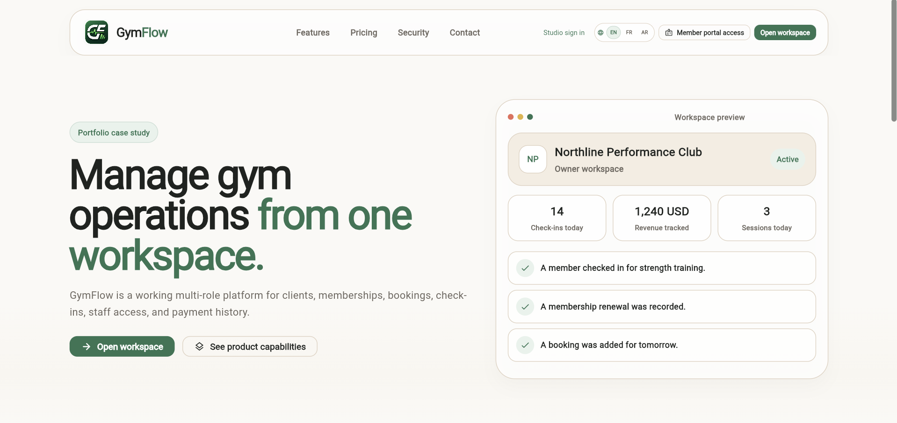
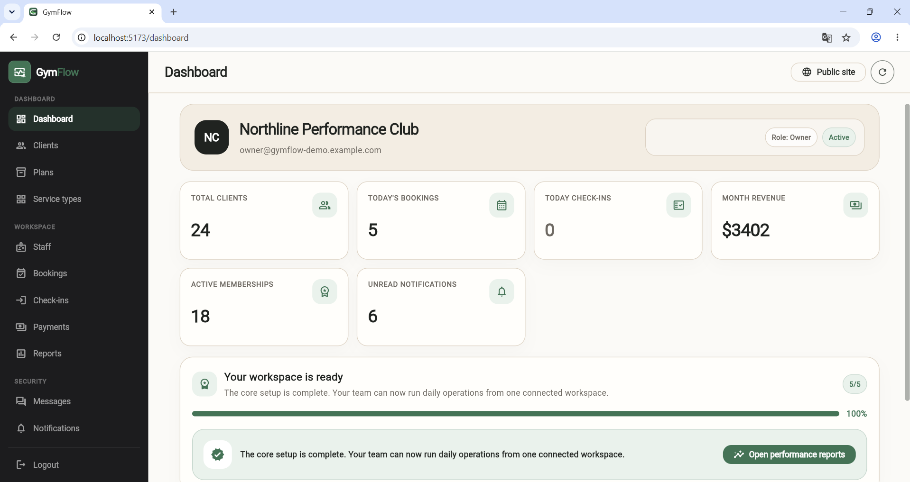
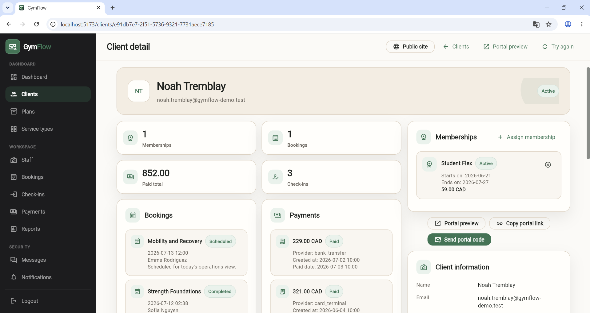
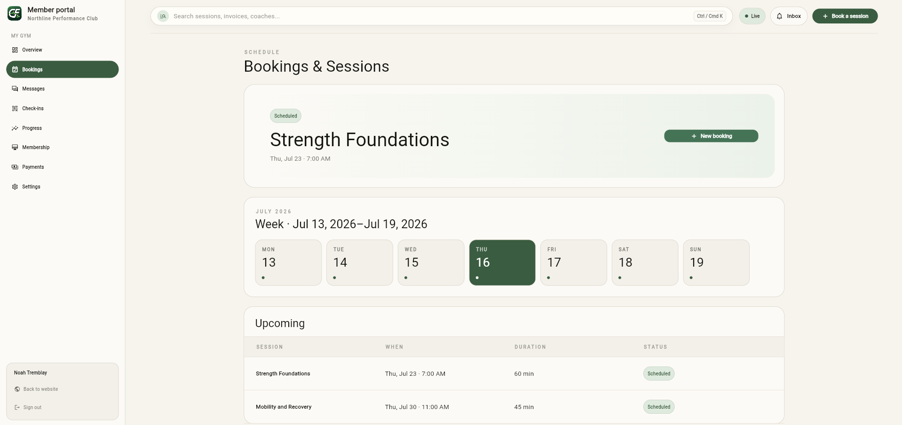
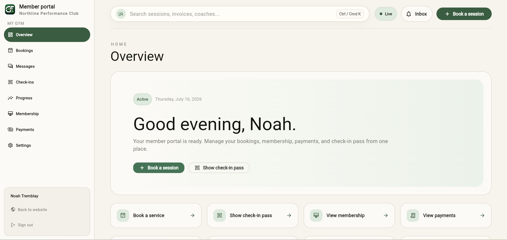
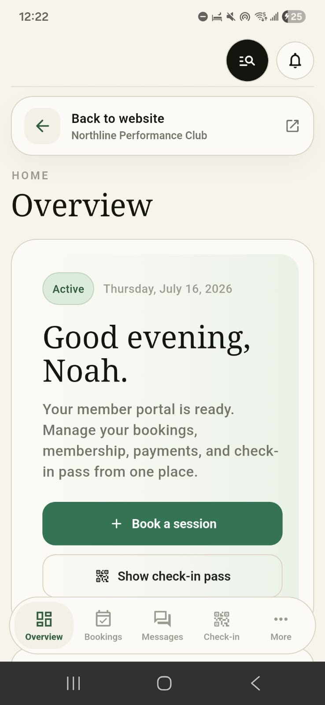
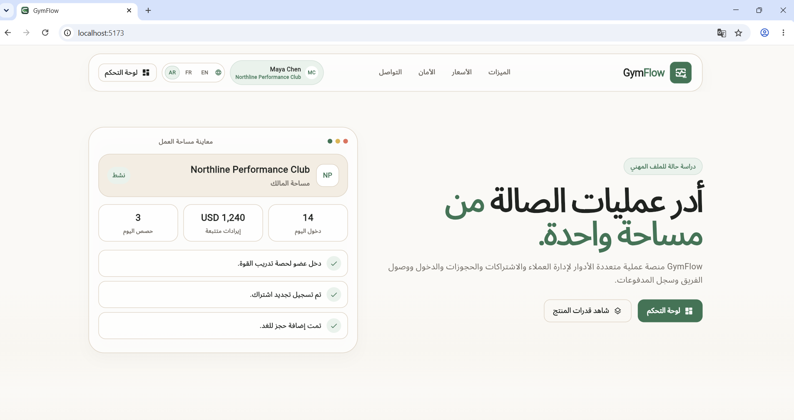

# GymFlow Visual Gallery

The `v1.0.1-showcase` candidate defines **53 stable screenshot paths** tied to
the frontend and backend revisions recorded in the
[build manifest](../BUILD_MANIFEST.md).

The gallery documents desktop, client-portal, mobile, localization, and
engineering perspectives. All identities and business records are fictional.
Payment states are manual, simulated, or Stripe test-mode only.

## Gallery contract

| Gallery | Directory | Count | Evidence represented |
|---|---|---:|---|
| Desktop | [`desktop/`](desktop/) | 22 | Public site and staff operations |
| Client portal | [`portal/`](portal/) | 10 | Member access and self-service |
| Mobile | [`mobile/`](mobile/) | 7 | Responsive public, staff, and portal surfaces |
| Localization | [`localization/`](localization/) | 4 | French and Arabic/RTL presentation |
| Engineering | [`engineering/`](engineering/) | 10 | Architecture, schema, API, runtime, deterministic summaries, and provenance |
| **Total** |  | **53** |  |

The filenames are a release contract. A final release must contain exactly these
paths, supported image formats, acceptable dimensions, and **53 unique image hashes**.
Renaming a misleading image is not a substitute for replacing its content.

## Evidence types

The gallery intentionally distinguishes three kinds of evidence:

- **Application captures** show the actual Flutter product at a reviewed viewport
  using fictional demo data.
- **Tool captures** show reviewed development or runtime tooling such as OpenAPI,
  Docker, schema inspection, or repository structure.
- **Curated engineering summaries** explain deterministic data, source history,
  or provenance in a readable presentation. They summarize recorded evidence and
  are not represented as raw command output.

## Selected product views

### Public experience

### Owner dashboard

### Connected client lifecycle

### Scheduling and member self-service

### Client portal

### Mobile member experience

### Arabic and RTL presentation

## Inventory

### Desktop — application captures

`01-public-home.png`, `02-owner-dashboard.png`,
`03-client-command-center.png`, `04-staff-presence.png`, `05-bookings.png`,
`06-reports.png`, `07-professional-messaging.png`, `08-public-features.png`,
`09-public-pricing.png`, `10-public-security.png`, `11-auth.png`,
`12-clients.png`, `13-plans.png`, `14-services.png`,
`15-trainer-availability.png`, `16-invitations.png`, `17-check-ins.png`,
`18-payments.png`, `19-notifications.png`, `20-activity-logs.png`,
`21-settings.png`, `22-billing.png`.

### Client portal — application captures

`00-access.png`, `01-portal-home.png`, `02-bookings.png`, `03-membership.png`,
`04-payments.png`, `05-receipt.png`, `06-progress.png`,
`07-check-in-pass.png`, `08-messages.png`, `09-profile-settings.png`.

### Mobile — application captures

`01-portal-home.png`, `02-portal-bookings.png`, `03-portal-payments.png`,
`04-check-in-pass.png`, `05-public-home.png`, `06-dashboard.png`,
`07-client-detail.png`.

### Localization — application captures

`01-arabic-rtl.png`, `02-french-dashboard.png`,
`03-arabic-portal-mobile.png`, `04-arabic-portal-desktop.png`.

### Engineering — tool captures and curated summaries

`07-frontend-project-structure.png`, `08-backend-project-structure.png`,
`09-postgresql-schema.png`, `10-openapi.png`, `11-docker-runtime.png`,
`12-demo-clients-data.png`, `13-demo-messages-data.png`,
`14-demo-payments-data.png`, `15-frontend-commit-history.png`,
`16-backend-commit-history.png`.

## Capture and privacy standard

A release image must not expose:

- a password, access token, signing material, API key, or live provider identifier;
- a valid check-in, portal, invitation, password-reset, or verification QR/code;
- real names, email addresses, phone numbers, payment data, or private messages;
- local usernames, absolute local paths, IP addresses, live logs, or unrelated notifications;
- browser zoom controls, developer overlays, broken localization, or unfinished UI states.

A QR used for portfolio illustration must encode a deliberately invalid static
payload and be visibly identified as a demo representation.

## Deterministic data and visual state

The guarded demo validator is authoritative for exact counts and relationships.
The screenshots demonstrate representative fictional application states. Values
that depend on date, active presence, temporary notifications, or the exact
capture moment can differ from the immediately post-seed validation report.
That distinction is recorded in the build manifest rather than hidden.

## Provenance and integrity

The candidate represents:

- frontend `main` at `8242f24fb05f0918393e439b5e0f1cc2e5f3086d`;
- backend `main` at `2234af20d1d9dd143bcac22edc699d3ee7fe515f`;
- the Northline Performance Club fictional scenario;
- reserved `.test` or IANA example-domain identities;
- manual, simulated, or Stripe test-mode payment states only.

The final release tag, source revisions, build manifest, validator result, and
reviewed image set together form the provenance record. Any screenshot that still
represents an older frontend generation must be recaptured or explicitly removed
from the selected evidence before the tag is created.
